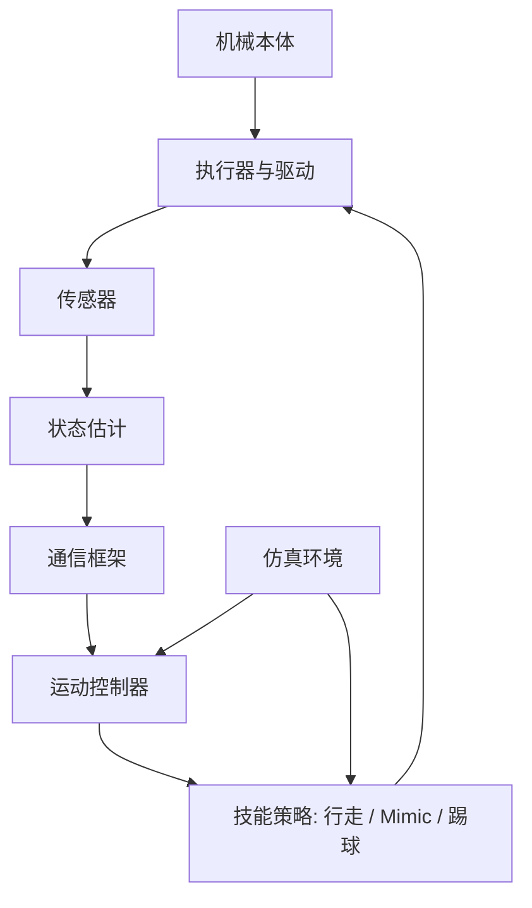

下面给你一套**可直接落地的 MkDocs 模板**，适合你的机器人文档站，包含：

- 目录结构
- `mkdocs.yml`
- GitHub Actions 部署文件
- 若干核心页面模板
- 在 **macOS 本地安装、运行、预览** 的完整步骤

我默认你要的是：

- 中文为主
- 技术文档站
- 包含机械、电路、通信、运动控制、仿真与模型、教程、FAQ
- 托管到 GitHub Pages

---

# 一、推荐的项目结构

假设你的仓库叫 `open-robot-docs`，目录建议这样：

```text
open-robot-docs/
├── .github/
│   └── workflows/
│       └── docs.yml
├── docs/
│   ├── index.md
│   ├── quickstart.md
│   ├── overview/
│   │   ├── architecture.md
│   │   ├── hardware-software-map.md
│   │   └── repo-structure.md
│   ├── mechanical/
│   │   ├── index.md
│   │   ├── body-structure.md
│   │   ├── joints-and-dof.md
│   │   ├── transmission.md
│   │   ├── materials.md
│   │   └── assembly.md
│   ├── electronics/
│   │   ├── index.md
│   │   ├── power.md
│   │   ├── controller.md
│   │   ├── sensors.md
│   │   ├── actuator-driver.md
│   │   ├── wiring.md
│   │   └── safety.md
│   ├── communication/
│   │   ├── index.md
│   │   ├── architecture.md
│   │   ├── middleware.md
│   │   ├── pubsub.md
│   │   ├── messages.md
│   │   ├── timing-and-sync.md
│   │   └── examples.md
│   ├── control/
│   │   ├── index.md
│   │   ├── kinematics.md
│   │   ├── dynamics.md
│   │   ├── state-machine.md
│   │   ├── gait.md
│   │   ├── mimic.md
│   │   ├── kicking.md
│   │   └── amp.md
│   ├── simulation/
│   │   ├── index.md
│   │   ├── urdf.md
│   │   ├── xml.md
│   │   ├── usd.md
│   │   ├── assets.md
│   │   └── sim2real.md
│   ├── tutorials/
│   │   ├── index.md
│   │   ├── bringup.md
│   │   ├── add-a-joint.md
│   │   ├── add-a-sensor.md
│   │   ├── train-walking.md
│   │   └── deploy-kick-policy.md
│   ├── reference/
│   │   ├── index.md
│   │   ├── configs.md
│   │   ├── messages.md
│   │   ├── topics.md
│   │   └── api.md
│   ├── development/
│   │   ├── index.md
│   │   ├── setup.md
│   │   ├── build.md
│   │   ├── testing.md
│   │   └── contributing.md
│   └── faq/
│       ├── index.md
│       ├── install.md
│       ├── simulation.md
│       └── hardware.md
├── requirements-docs.txt
├── mkdocs.yml
└── README.md
```

---

# 二、完整 `mkdocs.yml`

把下面内容保存为仓库根目录的 `mkdocs.yml`。

```yaml
site_name: Open Robot Docs
site_description: 开源机器人文档站，涵盖机械设计、电路系统、通信框架、运动控制、仿真与模型、教程和开发参考
site_url: https://yourname.github.io/open-robot-docs/
repo_url: https://github.com/yourname/open-robot-docs
repo_name: yourname/open-robot-docs
edit_uri: edit/main/docs/

theme:
  name: material
  language: zh
  favicon: assets/favicon.png
  features:
    - navigation.tabs
    - navigation.sections
    - navigation.expand
    - navigation.top
    - search.suggest
    - search.highlight
    - content.code.copy
    - content.tabs.link
    - content.action.edit
    - toc.follow

  palette:
    - media: "(prefers-color-scheme: light)"
      scheme: default
      primary: blue grey
      accent: indigo
      toggle:
        icon: material/weather-night
        name: 切换到深色模式
    - media: "(prefers-color-scheme: dark)"
      scheme: slate
      primary: blue grey
      accent: indigo
      toggle:
        icon: material/weather-sunny
        name: 切换到浅色模式

plugins:
  - search

markdown_extensions:
  - admonition
  - attr_list
  - md_in_html
  - tables
  - footnotes
  - toc:
      permalink: true
  - pymdownx.details
  - pymdownx.superfences:
      custom_fences:
        - name: mermaid
          class: mermaid
          format: !!python/name:pymdownx.superfences.fence_code_format
  - pymdownx.highlight
  - pymdownx.inlinehilite
  - pymdownx.snippets
  - pymdownx.tabbed:
      alternate_style: true
  - pymdownx.arithmatex:
      generic: true

extra_javascript:
  - javascripts/mathjax.js
  - https://cdn.jsdelivr.net/npm/mathjax@3/es5/tex-mml-chtml.js

extra:
  social:
    - icon: fontawesome/brands/github
      link: https://github.com/yourname/open-robot-docs

nav:
  - 首页: index.md
  - 快速开始: quickstart.md

  - 系统总览:
      - 总体架构: overview/architecture.md
      - 硬件与软件映射: overview/hardware-software-map.md
      - 仓库结构: overview/repo-structure.md

  - 机械设计:
      - 概览: mechanical/index.md
      - 本体结构: mechanical/body-structure.md
      - 关节与自由度: mechanical/joints-and-dof.md
      - 传动设计: mechanical/transmission.md
      - 材料与加工: mechanical/materials.md
      - 装配指南: mechanical/assembly.md

  - 电路系统:
      - 概览: electronics/index.md
      - 供电系统: electronics/power.md
      - 主控与下位机: electronics/controller.md
      - 传感器: electronics/sensors.md
      - 电机驱动: electronics/actuator-driver.md
      - 线束与接线: electronics/wiring.md
      - 安全设计: electronics/safety.md

  - 通信框架:
      - 概览: communication/index.md
      - 整体架构: communication/architecture.md
      - 中间件设计: communication/middleware.md
      - 发布订阅机制: communication/pubsub.md
      - 消息定义: communication/messages.md
      - 时间同步: communication/timing-and-sync.md
      - 示例代码: communication/examples.md

  - 运动控制:
      - 概览: control/index.md
      - 运动学: control/kinematics.md
      - 动力学: control/dynamics.md
      - 状态机: control/state-machine.md
      - 步态控制: control/gait.md
      - Mimic: control/mimic.md
      - 踢球: control/kicking.md
      - AMP 行走: control/amp.md

  - 仿真与模型:
      - 概览: simulation/index.md
      - URDF: simulation/urdf.md
      - XML: simulation/xml.md
      - USD: simulation/usd.md
      - 资源组织: simulation/assets.md
      - Sim-to-Real: simulation/sim2real.md

  - 教程:
      - 概览: tutorials/index.md
      - 从零启动系统: tutorials/bringup.md
      - 添加一个关节: tutorials/add-a-joint.md
      - 添加一个传感器: tutorials/add-a-sensor.md
      - 训练行走策略: tutorials/train-walking.md
      - 部署踢球策略: tutorials/deploy-kick-policy.md

  - 参考:
      - 概览: reference/index.md
      - 配置文件: reference/configs.md
      - 消息接口: reference/messages.md
      - Topics 与服务: reference/topics.md
      - API 参考: reference/api.md

  - 开发指南:
      - 概览: development/index.md
      - 环境配置: development/setup.md
      - 构建方式: development/build.md
      - 测试: development/testing.md
      - 贡献指南: development/contributing.md

  - FAQ:
      - 概览: faq/index.md
      - 安装问题: faq/install.md
      - 仿真问题: faq/simulation.md
      - 硬件问题: faq/hardware.md
```

---

# 三、`requirements-docs.txt`

保存为仓库根目录 `requirements-docs.txt`：

```txt
mkdocs>=1.6
mkdocs-material>=9.5
pymdown-extensions>=10.0
```

---

# 四、GitHub Pages 自动部署：`.github/workflows/docs.yml`

保存为：

```text
.github/workflows/docs.yml
```

内容如下：

```yaml
name: Deploy Docs

on:
  push:
    branches:
      - main
  workflow_dispatch:

permissions:
  contents: read
  pages: write
  id-token: write

concurrency:
  group: pages
  cancel-in-progress: true

jobs:
  build:
    runs-on: ubuntu-latest

    steps:
      - name: Checkout repository
        uses: actions/checkout@v4

      - name: Setup Python
        uses: actions/setup-python@v5
        with:
          python-version: "3.11"

      - name: Install documentation dependencies
        run: |
          python -m pip install --upgrade pip
          pip install -r requirements-docs.txt

      - name: Build MkDocs site
        run: mkdocs build

      - name: Upload site artifact
        uses: actions/upload-pages-artifact@v3
        with:
          path: site

  deploy:
    environment:
      name: github-pages
      url: ${{ steps.deployment.outputs.page_url }}
    runs-on: ubuntu-latest
    needs: build

    steps:
      - name: Deploy to GitHub Pages
        id: deployment
        uses: actions/deploy-pages@v4
```

---

# 五、给你几个核心页面模板

下面这些你可以直接复制。

---

## 1）`docs/index.md`

```markdown
# Open Robot Docs

欢迎来到开源机器人文档站。

这个文档站面向以下内容：

- 机械设计
- 电路系统
- 通信框架
- 运动控制
- 仿真与模型
- 教程与开发参考

## 文档入口

### 面向新用户
- [快速开始](quickstart.md)
- [系统总体架构](overview/architecture.md)
- [从零启动系统](tutorials/bringup.md)

### 面向机械设计
- [机械设计概览](mechanical/index.md)
- [本体结构](mechanical/body-structure.md)
- [关节与自由度](mechanical/joints-and-dof.md)

### 面向电控与嵌入式
- [电路系统概览](electronics/index.md)
- [供电系统](electronics/power.md)
- [主控与下位机](electronics/controller.md)

### 面向算法与控制
- [运动控制概览](control/index.md)
- [步态控制](control/gait.md)
- [AMP 行走](control/amp.md)
- [踢球](control/kicking.md)

### 面向仿真开发
- [仿真与模型概览](simulation/index.md)
- [URDF](simulation/urdf.md)
- [XML](simulation/xml.md)
- [USD](simulation/usd.md)

## 系统概览

!!! note "项目定位"
    本项目是一个覆盖硬件、软件、控制与仿真的开源机器人平台，
    目标是让研究者和开发者能够快速理解系统结构、复现实验流程，并扩展自己的模块。

## 一个典型的数据流


## 推荐阅读路径

1. 先阅读 [系统总体架构](overview/architecture.md)
2. 再看 [快速开始](quickstart.md)
3. 根据方向进入：
   - 机械设计
   - 电路系统
   - 通信框架
   - 运动控制
   - 仿真与模型
```

---

## 2）`docs/quickstart.md`

```markdown
# 快速开始

本页帮助你快速理解并运行整个机器人系统。

## 你将完成什么

- 了解文档结构
- 配置本地开发环境
- 跑通最小示例
- 找到后续阅读路径

## 前置知识

建议你至少具备以下基础之一：

- 机器人学基础
- Linux / Python 基础
- 控制理论基础
- 仿真环境使用经验

## 推荐阅读顺序

1. [系统总体架构](overview/architecture.md)
2. [仓库结构](overview/repo-structure.md)
3. [环境配置](development/setup.md)
4. [从零启动系统](tutorials/bringup.md)

## 模块速览

| 模块 | 内容 |
|---|---|
| 机械设计 | 本体结构、关节、传动、材料、装配 |
| 电路系统 | 供电、主控、传感器、驱动、安全 |
| 通信框架 | 消息传输、节点关系、时间同步 |
| 运动控制 | 运动学、动力学、状态机、步态、技能 |
| 仿真与模型 | URDF、XML、USD、资源组织、Sim-to-Real |

## 最小命令示例

```bash
git clone https://github.com/yourname/open-robot-docs.git
cd open-robot-docs
```

!!! tip "提示"
    如果你还没有真正的机器人代码仓库，这个文档仓库可以先独立存在。
```

---

## 3）`docs/overview/architecture.md`

```markdown
# 系统总体架构

本页描述机器人系统从硬件到软件的总体组织方式。

## 系统组成

整个系统可以拆分为以下几层：

1. 机械本体
2. 电气与执行层
3. 传感与状态估计
4. 通信中间件
5. 运动控制与技能层
6. 仿真与训练环境
7. 开发与部署工具链

## 架构图



## 各层职责

## 机械本体
负责关节布局、自由度设计、结构强度、传动形式与可维护性。

## 电气与执行层
负责供电、驱动、控制板连接、执行器接口和安全保护。

## 通信框架
负责不同模块间的数据交换，定义消息格式、传输频率和同步方式。

## 运动控制层
负责将高层目标转化为执行器命令，包括：

- 轨迹生成
- 逆运动学
- 平衡控制
- 步态控制
- 技能状态机

## 仿真与训练层
负责模型导入、环境搭建、策略训练、评估以及 sim-to-real 迁移。

## 推荐阅读

- [硬件与软件映射](hardware-software-map.md)
- [通信框架概览](../communication/index.md)
- [运动控制概览](../control/index.md)
- [仿真与模型概览](../simulation/index.md)
```

---

## 4）`docs/communication/index.md`

```markdown
# 通信框架概览

本部分介绍机器人系统内部模块如何交换数据、同步状态并组织控制流程。

## 主要内容

- 节点组织方式
- 发布订阅机制
- 消息定义
- 时间同步
- 示例代码

## 为什么需要通信框架

在一个机器人系统中，不同模块往往运行在不同进程、不同线程，甚至不同硬件上，例如：

- 传感器采集
- 状态估计
- 运动控制
- 上位机可视化
- 日志系统

通信框架的作用是为这些模块提供统一的数据交换机制。

## 推荐阅读

- [整体架构](architecture.md)
- [中间件设计](middleware.md)
- [发布订阅机制](pubsub.md)
- [消息定义](messages.md)
- [时间同步](timing-and-sync.md)
```

---

## 5）`docs/control/index.md`

```markdown
# 运动控制概览

本部分介绍机器人从基础运动学到高级行为技能的控制体系。

## 内容范围

- 运动学
- 动力学
- 状态机
- 步态控制
- Mimic
- 踢球
- AMP 行走

## 控制层次

一个典型的控制系统可分为以下几层：

1. 感知与状态估计
2. 高层行为决策
3. 轨迹或目标生成
4. 低层控制与执行

## 一个典型流程


## 建议阅读顺序

1. [运动学](kinematics.md)
2. [动力学](dynamics.md)
3. [状态机](state-machine.md)
4. [步态控制](gait.md)
5. [Mimic](mimic.md)
6. [踢球](kicking.md)
7. [AMP 行走](amp.md)
```

---

## 6）`docs/simulation/index.md`

```markdown
# 仿真与模型概览

本部分介绍机器人模型在不同仿真工具链中的表示方式，以及从模型到控制、从仿真到实机的连接关系。

## 包含内容

- URDF
- XML
- USD
- 资源组织
- Sim-to-Real

## 为什么这一层重要

仿真层不仅决定模型能否正确显示和运行，还会直接影响：

- 惯量参数
- 接触模型
- 关节约束
- 控制接口
- 训练环境表现

## 推荐阅读

- [URDF](urdf.md)
- [XML](xml.md)
- [USD](usd.md)
- [Sim-to-Real](sim2real.md)
```

---

## 7）示例占位页模板

例如 `docs/mechanical/index.md`：

```markdown
# 机械设计概览

本部分介绍机器人机械本体的设计思路与实现方式。

## 内容包括

- 本体结构
- 关节与自由度
- 传动设计
- 材料与加工
- 装配指南

## 推荐阅读

- [本体结构](body-structure.md)
- [关节与自由度](joints-and-dof.md)
- [传动设计](transmission.md)
```

你可以把其他大多数页面先写成这种占位版本，后面慢慢填充。

---

# 六、MathJax 支持文件

上面的 `mkdocs.yml` 里引用了：

```text
javascripts/mathjax.js
```

所以你需要创建：

```text
docs/javascripts/mathjax.js
```

内容如下：

```javascript
window.MathJax = {
  tex: {
    inlineMath: [['\\(', '\\)']],
    displayMath: [['\\[', '\\]']],
    processEscapes: true,
    processEnvironments: true
  },
  options: {
    ignoreHtmlClass: ".*|",
    processHtmlClass: "arithmatex"
  }
};

document$.subscribe(() => {
  MathJax.typesetPromise();
});
```

---

# 七、可选：favicon

你在 `mkdocs.yml` 写了：

```yaml
favicon: assets/favicon.png
```

所以最好准备一个文件：

```text
docs/assets/favicon.png
```

如果暂时没有，可以先把这一行删掉。

---

# 八、macOS 本地安装与预览

下面是最实用的部分。

---

## 方案 A：用 Python 虚拟环境安装
这是最推荐的方式。

---

## 第 1 步：确认 Mac 上有 Python 3

打开终端执行：

```bash
python3 --version
```

如果能看到类似：

```bash
Python 3.11.9
```

就可以继续。

如果没有，就先安装 Python。

最简单的方法是用 Homebrew：

```bash
brew install python
```

如果你还没有 Homebrew，可以先安装它：

```bash
/bin/bash -c "$(curl -fsSL https://raw.githubusercontent.com/Homebrew/install/HEAD/install.sh)"
```

---

## 第 2 步：进入你的仓库目录

例如：

```bash
cd ~/Documents/open-robot-docs
```

---

## 第 3 步：创建虚拟环境

```bash
python3 -m venv .venv
```

这会在当前目录生成 `.venv` 文件夹。

---

## 第 4 步：激活虚拟环境

```bash
source .venv/bin/activate
```

激活后终端前面通常会出现：

```bash
(.venv)
```

---

## 第 5 步：升级 pip

```bash
python -m pip install --upgrade pip
```

---

## 第 6 步：安装文档依赖

```bash
pip install -r requirements-docs.txt
```

如果你还没创建那个文件，也可以直接装：

```bash
pip install mkdocs mkdocs-material pymdown-extensions
```

---

## 第 7 步：启动本地预览

在仓库根目录执行：

```bash
mkdocs serve
```

成功后你会看到类似输出：

```bash
INFO    -  Building documentation...
INFO    -  Cleaning site directory
INFO    -  Documentation built in 0.45 seconds
INFO    -  [12:34:56] Watching paths for changes: 'docs', 'mkdocs.yml'
INFO    -  [12:34:56] Serving on http://127.0.0.1:8000/
```

然后浏览器打开：

```text
http://127.0.0.1:8000
```

就能预览网站。

---

## 第 8 步：停止预览

在终端里按：

```bash
Ctrl + C
```

---

# 九、以后每次在 mac 上怎么重新打开预览

以后你每次只要这样：

```bash
cd ~/Documents/open-robot-docs
source .venv/bin/activate
mkdocs serve
```

然后打开：

```text
http://127.0.0.1:8000
```

---

# 十、如何新建页面

比如你要新建一个页面：

```text
docs/control/balance.md
```

内容：

```markdown
# 平衡控制

这里介绍机器人的平衡控制方法。
```

然后再去 `mkdocs.yml` 里加导航：

```yaml
  - 运动控制:
      - 概览: control/index.md
      - 运动学: control/kinematics.md
      - 动力学: control/dynamics.md
      - 平衡控制: control/balance.md
```

保存后，本地页面会自动刷新。

---

# 十一、如何部署到 GitHub Pages

当你把这些文件 push 到 GitHub 后：

## 第 1 步：进入仓库设置
- `Settings`
- `Pages`

## 第 2 步：Source 选择
- **GitHub Actions**

## 第 3 步：push 到 `main`
例如：

```bash
git add .
git commit -m "Add MkDocs documentation site"
git push origin main
```

## 第 4 步：等待 Actions 跑完
去仓库的 `Actions` 页面看构建是否成功。

成功后你的网站通常会出现在：

```text
https://yourname.github.io/open-robot-docs/
```

---

# 十二、首次使用最容易踩的坑

---

## 1. `site_url` 没改
你需要把：

```yaml
site_url: https://yourname.github.io/open-robot-docs/
```

改成你自己的 GitHub 用户名和仓库名。

---

## 2. `repo_url` 没改
把：

```yaml
repo_url: https://github.com/yourname/open-robot-docs
repo_name: yourname/open-robot-docs
```

改成你自己的。

---

## 3. favicon 文件不存在
如果你还没准备 `docs/assets/favicon.png`，先删掉这一行：

```yaml
favicon: assets/favicon.png
```

---

## 4. 页面路径写错
比如导航里写了：

```yaml
- 踢球: control/kicking.md
```

但实际没有这个文件，`mkdocs serve` 会报错。

---

## 5. Mermaid 图不显示
如果你后面发现 Mermaid 没正常渲染，我可以再给你补一个 Material 版本兼容配置。

---

# 十三、建议你先最小化启动

不要一开始把 40 个页面都写满。  
最好的启动方式是：

## 第一批先写这 8 页
- `index.md`
- `quickstart.md`
- `overview/architecture.md`
- `mechanical/index.md`
- `electronics/index.md`
- `communication/index.md`
- `control/index.md`
- `simulation/index.md`

先让站点完整跑起来，再逐步扩展具体章节。

---

# 十四、你现在可以直接复制执行的 mac 命令

如果你已经有仓库目录，可以直接按这个顺序：

```bash
cd ~/Documents/open-robot-docs
python3 -m venv .venv
source .venv/bin/activate
python -m pip install --upgrade pip
pip install mkdocs mkdocs-material pymdown-extensions
mkdocs serve
```

浏览器打开：

```text
http://127.0.0.1:8000
```

---

如果你愿意，我下一条还能继续直接给你两样东西中的任意一个：

1. **把上面这些目录下的所有占位 Markdown 文件一次性全部生成给你**
2. **继续给你一个更漂亮的首页模板**，包括卡片入口、提示块、架构说明、更像正式开源项目主页的风格

如果你想省事，直接回复我：

**“继续，把所有占位 md 文件也生成出来”**