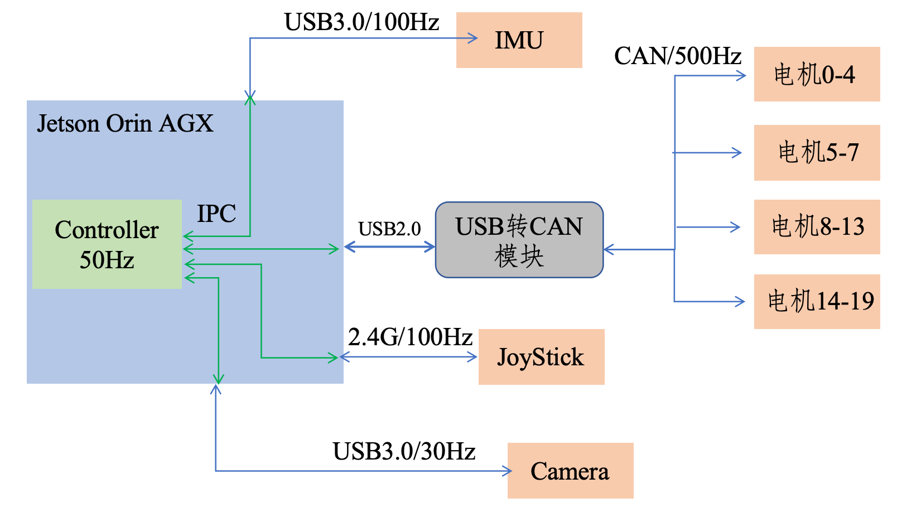
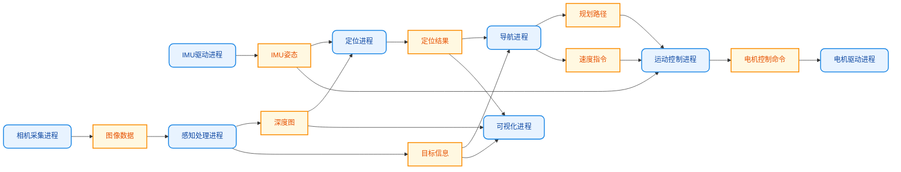

# 通信框架概览

本部分介绍机器人系统传感器外部通讯以及主机内部通讯设计

## 传感器物理通讯

大多数机器人系统都会配置一个**上位机（Host Computer）**，负责运行机器人操作系统（如 ROS 2）、运动控制、状态估计、路径规划、视觉感知以及神经网络推理等，同时采集各类传感器数据，并向电机驱动器发送控制指令。

上位机通常采用运行 Linux 等操作系统的高性能计算平台，例如 NVIDIA Jetson 系列（Orin Nano、Orin NX、AGX Orin）、x86 工控机或 Intel 主板等。对于功能较为简单的机器人，也可以使用 Raspberry Pi 等单板计算机作为上位机。

部分机器人还会增加一个**下位机（Embedded Controller）**。下位机通常采用 MCU（如 STM32）、DSP 或其他实时控制器，主要负责与电机驱动器、编码器、IMU、力传感器等硬件进行通信，并执行关节级的位置、速度或力矩控制，以及数据采集、安全保护和故障检测等高频实时任务。上位机则通过 CAN、EtherCAT、UART、SPI、USB 或 Ethernet 等通信总线与下位机交换数据，下发控制目标，并获取机器人状态信息。

采用下位机的主要优势是其通常运行裸机程序或实时操作系统（RTOS），具有较低的中断响应延迟和更强的实时性，能够稳定执行毫秒级的控制任务。同时，下位机可以承担底层设备通信和实时控制工作，减轻上位机的负担，提高系统的可靠性和可维护性。但是由于上下位机之间需要进行数据通信，会引入一定的通信延迟，但在合理设计通信协议和控制架构的情况下，这部分开销会比较小。

<div class="grid cards" markdown>

- ### 单上位机

    ```mermaid
    flowchart LR
        A[传感器]
        B[上位机<br/>Jetson / Intel]
        C[控制算法]
        D[电机驱动器]

        A --> B
        B --> C
        C --> B
        B --> D
    ```

- ### 上下位机

    ```mermaid
    flowchart LR
        A[传感器]
        B[下位机<br/>STM32]
        C[上位机<br/>Jetson]
        D[控制算法]
        E[电机驱动器]

        A --> B
        B --> E
        B <-->|CAN / EtherCAT| C
        C --> D
        D --> C
    ```

</div>

但是，下位机并非机器人系统的必需组成部分，其是否采用取决于机器人的控制需求、硬件配置以及系统复杂度。随着现代处理器性能的不断提升，以及 Linux 实时内核（PREEMPT_RT）、EtherCAT、CAN FD 等实时技术的发展，许多机器人已经能够采用**单上位机架构**完成整个控制流程。在这种架构下，上位机直接与传感器和电机驱动器通信，同时运行状态估计、运动控制、感知和决策等算法，能够满足许多研究平台、教育机器人和开源机器人的控制需求。

MOS9采用单上位机架构，以 NVIDIA Jetson Orin 为核心控制平台，直接完成传感器数据采集、电机驱动器通信以及机器人运动控制等任务。该方案结构简单、硬件成本较低、开发和调试方便，并能够满足本机器人控制系统的实时性要求，因此未额外设计下位机。

与传感器通讯方式有多种，USB、CAN、串口通信等等，现在大多数传感器集成的都很好，大多数可以用USB通讯，所以我们最终设计通讯框架如下：

<figure class="ros-figure ros-figure--narrow">
    
    <figcaption>通讯框架</figcaption>
</figure>


## 进程间通讯

进程间通讯，即主机内各个进程之间数据通讯。在机器人系统中，通常会使用多种传感器信息，例如图像、IMU、驱动器信号、麦克风数据等；还会涉及一些中间结果信息，例如双目图像处理得到的深度图、识别出的物体信息、定位结果等。这些信息的数据规模可能差异很大。例如：

- 尺寸为 1920×1080 的浮点型深度图或点云数据；
- 尺寸为 1920×1080 的 int8 图像数据；
- 由 4 个浮点数组成的 IMU 姿态四元数；
- 来自 20 个电机的 CAN 数据报，例如 20×64 字节的数据块。

这些消息通常需要在多个进程之间进行读取、处理和发送，而且同一份信息往往会被多个进程共享。例如，运动控制模块和导航模块可能同时需要读取 IMU 姿态信息。因此，在机器人软件架构设计中，如何高效组织多进程之间的通信、管理不同类型和不同规模的消息，并支持多模块并发访问，是一个非常重要的问题。

下面的示意图展示了机器人系统中常见的几个进程，以及它们之间通过消息进行通信的关系。其中圆角框表示进程，方框表示消息。



在机器人软件开发中，很多人会优先选择 ROS、DDS、ZMQ 等通信框架。这些框架主要面向分布式节点通信场景设计，在多机协同、远程控制、跨设备部署和复杂系统集成中具有明显优势。然而，如果系统边界仅限于单个机器人本体内部，不涉及多机器人通信、远程控制或分布式计算，那么这类框架提供的许多能力实际上并不是刚需。相反，它们额外引入的抽象层、序列化开销以及调度复杂性，可能会使系统设计变重，甚至形成过度设计。

对于机器人主机内通信来说，更重要的目标通常是：高频、低延迟、低抖动。尤其在状态同步、感知结果共享和运动控制等场景中，通信机制越简单直接，往往越容易获得更好的实时性。因此，共享内存、无锁队列，乃至同进程内函数调用，通常是更高效的实现方式。基于这些需求，我们实现了一套轻量化的机器人通信中间件。该中间件专注于机器人主机内部通信，只采用共享内存机制，从而实现低延迟、大带宽的进程间数据传输。更多内容请参见 Robot-IPC 章节。


