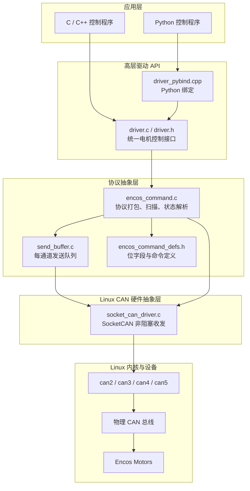
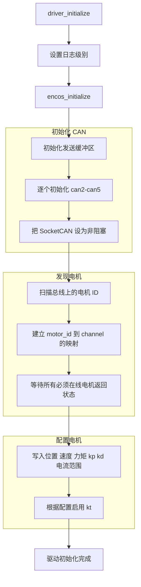
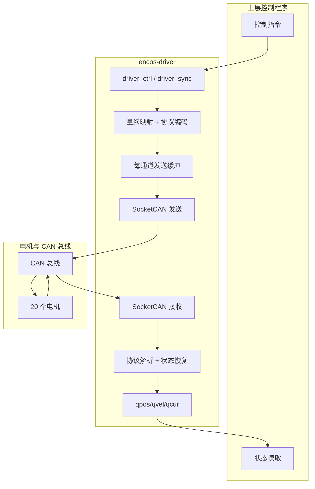

# 电机 CAN 通信驱动

机器人上比较重要的通讯代码就是电机通讯，其他传感器通讯比如相机、IMU都有官方给的程序，这里着重解析电机的通讯设计。

本节分析 MOS9 使用的电机 CAN 通信驱动库 [Github: encos-driver](https://github.com/THMOS2025/encos-driver.git)

这个库本质上是一个运行在 Linux 上的 SocketCAN 高层驱动，用来完成以下事情：

- 自动拉起 CAN 网口
- 扫描总线上的 Encos 电机
- 将位置、速度、力矩、kp、kd 等高层控制量编码成电机协议帧
- 从电机反馈帧中恢复位置、速度、电流等状态
- 向上提供统一的 C API
- 通过 pybind11 向 Python 暴露同一套高层驱动接口

从代码实现看，这个库不是通用 CAN 工具库，而是一个针对 Encos 电机协议定制的“电机控制驱动层”。它的目标不是让用户直接操作 CAN 帧，而是让上层控制程序直接面对“关节状态”和“关节控制量”。

## 1. 总体定位

这个库的核心价值，在于把三类复杂性都藏到了驱动内部：

- Linux SocketCAN 设备操作复杂性
- 电机私有二进制协议复杂性
- 多电机、多通道同步控制复杂性

因此，上层调用者不需要直接管理：

- `PF_CAN` 原始套接字
- `bind`、`ioctl`、`fcntl`
- 控制量到 bitfield 的打包
- 电机扫描与 ID 对应关系
- 状态帧解析与量纲恢复

上层只需要调用：

- `driver_initialize()`
- `driver_ctrl()`
- `driver_sync()`
- `driver_get_pos()` / `driver_get_vel()` / `driver_get_cur()`

这说明它在系统中的角色，不是“通信框架”，而是“电机驱动抽象层”。

## 2. 总体架构

从源码结构看，这个库可以分成四层。



这张图反映了两个非常关键的设计点：

1. Python 端并不是直接操作 CAN，而是通过 pybind11 调同一个 `driver.c` 高层接口。
2. 电机协议实现与 Linux SocketCAN 实现是分开的，前者负责“电机语义”，后者负责“总线收发”。

## 3. 代码结构与职责划分

### 3.1 高层驱动接口层

高层入口在 `include/driver.h` 与 `src/driver.c`。

它暴露的主要接口有：

- `driver_initialize()`
- `driver_uninitialize()`
- `driver_ctrl()`
- `driver_sync()`
- `driver_set_zero()`
- `driver_set_id()`
- `driver_send_query()`
- `driver_get_pos()`
- `driver_get_vel()`
- `driver_get_cur()`

这一层的作用，是把所有电机控制统一抽象成“20 个关节的一组数组”。例如 `driver_ctrl()` 一次接收五组长度为 `MOTOR_COUNT` 的数组：

- `kp[]`
- `kd[]`
- `target_pos[]`
- `target_vel[]`
- `target_tor[]`

这意味着它的接口设计不是“按电机逐个发命令”，而是“按整机一帧控制周期发命令”。这非常符合机器人控制循环的使用方式。

### 3.2 协议抽象层

协议层集中在：

- `src/encos/encos_command.c`
- `src/encos/encos_command_defs.h`

这一层负责：

- 把高层控制变量映射为电机协议位字段
- 管理每个电机属于哪个 CAN 通道
- 扫描总线并发现电机
- 解析不同类型的电机响应帧
- 维护当前的电机状态缓存

这是整个库最核心的一层，因为它把“CAN 收发”提升成了“电机控制协议”。

### 3.3 发送缓冲层

发送缓冲在 `src/send_buffer.c` 中实现。

它为每个通道维护一个环形队列：

- `CHANNEL_COUNT = 4`
- `SEND_BUFFER_SIZE = 1024`

作用是把协议层生成的待发送 CAN 帧按通道暂存起来，然后由 `push_msg()` 统一刷到总线。

这个设计有两个好处：

- 协议层可以先组织完整的一轮多电机发送，再集中下发
- 每个通道的发送顺序得到保持，不会因为上层调用顺序混乱而直接打散

### 3.4 SocketCAN 硬件抽象层

硬件层在：

- `src/socket_can_driver.c`
- `src/socket_can_driver.h`

这层是最贴近 Linux 的部分，主要负责：

- `socket(PF_CAN, SOCK_RAW, CAN_RAW)` 创建原始 CAN 套接字
- `ioctl(..., SIOCGIFINDEX, ...)` 根据接口名解析索引
- `bind()` 把套接字绑定到指定 `canX`
- `fcntl(..., O_NONBLOCK)` 设置为非阻塞模式
- `read()` / `write()` 完成 CAN 帧收发

另外它还会通过：

```bash
sudo ip link set canX up type can bitrate 1000000 loopback off
```

在初始化时尝试自动拉起 CAN 网口。因此运行程序的用户需要具备相应权限。

## 4. 系统常量与运行规模

从 `src/constant.h` 与 `src/constant.c` 可以看到，该驱动当前假定：

- `MOTOR_COUNT = 20`
- `CHANNEL_COUNT = 4`
- `SEND_BUFFER_SIZE = 1024`
- 默认 CAN 口为 `can2`, `can3`, `can4`, `can5`

这说明它不是面向任意规模设备的完全通用库，而是已经针对目标机器人做了工程配置。

另外，`MUST_ONLINE_MOTOR` 当前 20 个电机都设为 `true`，意味着初始化阶段默认认为所有电机都必须在线。

## 5. 初始化流程

初始化入口是 `driver_initialize()`，它本身很薄，真正核心逻辑在 `encos_initialize()` 中。

整体初始化流程如下。



### 5.1 初始化 CAN 通道

`encos_initialize()` 会依次调用 `initialize_can(i)`。

每个通道初始化会做这些事情：

1. 检查通道编号是否合法。
2. 如果该通道已经初始化，则直接返回。
3. 执行 `ip link set canX up ...` 拉起设备。
4. 创建 `PF_CAN` 原始套接字。
5. 设为 `O_NONBLOCK`。
6. 通过 `ioctl` 获取接口索引。
7. `bind` 到对应 `canX` 设备。

这说明驱动选择了“非阻塞轮询”模型，而不是阻塞式等待模型。

### 5.2 扫描电机

扫描逻辑在 `scan_motors()` 中。

它会在各个可用通道上广播 `query_id` 命令，然后读取各通道返回，解析出：

- 哪些电机存在
- 某个电机 ID 位于哪个 CAN 通道

内部维护的核心状态有：

- `channel_available[]`
- `motor_to_channel[]`
- `motor_found[]`
- `motor_error[]`

其中 `motor_to_channel[id]` 很重要，它是后续所有单电机命令的路由依据。

### 5.3 等待电机上线

仅扫描到 ID 还不够，驱动还会进入 `wait_motors_online()`，不断查询位置，直到：

- 所有必须在线的电机都返回了有效位置
- 或者超时

这一步相当于把“总线发现”提升为“电机真正可通信”。

### 5.4 下发量程配置

初始化成功后，`driver_initialize()` 会调用：

- `encos_set_pos_range()`
- `encos_set_vel_range()`
- `encos_set_tor_range()`
- `encos_set_cur_range()`
- `encos_set_kp_range()`
- `encos_set_kd_range()`
- `encos_enable_kt()`

这些范围来自 `src/constant.c` 中的编译期常量。

这说明该驱动并不是简单透传 SDK，而是维护了一套“物理量范围配置”，用于控制量和反馈量的双向映射。

## 6. 控制命令是怎样编码成 CAN 帧的

这一点是整个驱动最值得注意的地方。

在 `encos_command_defs.h` 中，驱动把一帧 64 bit CAN 数据定义成多个位字段结构。对控制命令来说，核心定义是：

```c
struct {
	uint qtor: 12;
	uint qvel: 12;
	uint qpos: 16;
	uint kd:    9;
	uint kp:   12;
	uint mode:  3;
} ctrl;
```

这意味着一条 8 字节控制帧内部实际打包了：

- `kp`：12 bit
- `kd`：9 bit
- `qpos`：16 bit
- `qvel`：12 bit
- `qtor`：12 bit
- `mode`：3 bit

高层控制量在发送前，会先做线性映射：

- 实际位置区间 `pos_range[id]` 映射到 `0 ~ 65535`
- 实际速度区间 `vel_range[id]` 映射到 `0 ~ 4095`
- 实际力矩区间 `tor_range[id]` 映射到 `0 ~ 4095`
- `kp` 映射到 `0 ~ 4095`
- `kd` 映射到 `0 ~ 511`

也就是说，库暴露给用户的是连续物理量，网络上传输的是受位宽限制的离散整数编码。

### 6.1 控制下发流程

`driver_ctrl()` 会调用 `encos_ctrl()`，后者按电机循环执行：

1. 检查电机是否有最近心跳。
2. 检查电机是否上报错误码。
3. 将 `kp/kd/pos/vel/tor` 映射为整数。
4. 使用 `COMMAND_CTRL(...)` 宏拼成 64 bit CAN 数据。
5. 将该帧压入该电机所在通道的发送缓冲。
6. 由 `push_msg()` 统一把多通道缓冲刷出。

这说明一次 `driver_ctrl()` 调用，本质上是在完成“整机所有电机的一轮控制帧组包和发送”。

## 7. 状态反馈是怎样解析的

该库接收帧后并不是直接返回给用户，而是先由协议层做多种响应解析。

核心解析函数有：

- `parse_query_id()`
- `parse_set_id()`
- `parse_set_zero()`
- `parse_set_range()`
- `parse_enable_kt()`
- `parse_response_1()`
- `parse_response_4()`
- `parse_response_5()`

其中最重要的是状态反馈：

### 7.1 `response_1`

`response_1` 是常规状态帧，里面包含：

- `position`
- `velocity`
- `current`
- `motor_temp`
- `mos_temp`
- `error_no`

驱动收到这类帧后，会把原始整数值通过 `unmap()` 恢复成浮点物理量，并写入：

- `current_qpos[]`
- `current_qvel[]`
- `current_qcur[]`

这三个数组就是上层 `driver_get_pos()`、`driver_get_vel()`、`driver_get_cur()` 返回的底层状态缓存。

### 7.2 `response_5`

`response_5` 看起来是某些查询命令的扩展返回，驱动当前支持的 code 主要有：

- code = 1：位置
- code = 2：速度

并且会把角度值从度转换到弧度，把转速值转换到弧度每秒。

### 7.3 错误与超时

每当收到来自某个电机的帧，驱动都会更新 `motor_last_seen_time[id]`。

在 `encos_ctrl()` 中，如果发现某个电机超过 1 秒没有被看到，就会认为它超时失联：

- 从映射表里移除该电机
- 如果它属于必须在线电机，则返回 `MOTOR_TIMEOUT`

此外，如果反馈帧里 `error_no != 0`，驱动会记录错误码；后续控制时若该电机仍有错误，会返回 `MOTOR_ERROR`。

## 8. 发送缓冲与通道调度

`send_buffer.c` 实现的是一个很朴素但很实用的设计：每个通道一个环形发送队列。

### 8.1 为什么需要发送缓冲

如果协议层一边遍历电机、一边直接 `write()` 到 CAN 套接字，会有几个问题：

- 多通道控制的发送顺序难以统一组织
- 某个通道短时拥塞时，逻辑层不方便继续组织其他电机命令
- 配置命令和控制命令混发时不容易保证批量操作的完整性

所以这里先 `send_buffer_push()`，最后由 `push_msg()` 批量刷出。

### 8.2 `push_msg()` 如何工作

`push_msg()` 会循环检查所有通道：

- 如果某个通道缓冲不空，就弹出一帧并发送
- 如果所有通道都空了，就结束
- 每轮循环之后 `usleep(100)`，避免紧密忙等

这是一种简单的轮询调度器。它没有复杂优先级，但在当前 20 电机、4 通道的规模下已经足够工程使用。

## 9. `driver_sync()` 的含义

`driver_sync()` 的实现非常直接：

1. `encos_query(1)`
2. `encos_query(2)`
3. 等待约 1 ms
4. `pull_msg()` 拉取并解析返回

也就是说，它不是做同步屏障，而是主动发起一轮状态查询，再把反馈刷新到本地缓存。

因此在系统语义上，`driver_sync()` 更接近：

- “主动刷新状态缓存”

而不是：

- “严格时钟同步”

## 10. C 和 Python 接口关系

这个库的 Python 接口并不是独立实现的，它本质上是 `driver.h` 的 pybind11 包装。

也就是说：

- C 端调用 `driver_initialize()`
- Python 端调用 `encos_python.initialize()`

它们最终都走到同一个 `driver.c` 实现。

对应关系大致如下：

| C API | Python API | 说明 |
|---|---|---|
| `driver_initialize()` | `initialize()` | 初始化驱动 |
| `driver_uninitialize()` | `uninitialize()` | 关闭驱动 |
| `driver_ctrl()` | `ctrl()` | 一次下发全部电机控制量 |
| `driver_sync()` | `sync()` | 主动拉取状态 |
| `driver_get_pos()` | `get_pos()` | 获取位置数组 |
| `driver_get_vel()` | `get_vel()` | 获取速度数组 |
| `driver_get_cur()` | `get_cur()` | 获取电流数组 |
| `driver_set_zero()` | `set_zero()` | 设零 |
| `driver_set_id()` | `set_id()` | 改 ID |
| `driver_send_query()` | `send_query()` | 发送查询命令 |

因此，这个库的语言边界设计是很整齐的：

- C / C++ / Python 共用同一套高层电机语义
- 协议实现只有一份
- 硬件驱动实现也只有一份

Python 绑定里 `get_pos()`、`get_vel()`、`get_cur()` 还会返回只读 numpy 数组，直接引用底层状态内存，减少了一次多余复制。

## 11. 控制与反馈数据流

下面这张图把一轮控制周期中的命令流和反馈流放在一起。



这张图揭示了一个很重要的事实：

- 上层程序看到的是“数组控制”和“数组状态”
- 中间驱动承担了所有“协议编码、通道调度、反馈解析”工作

因此该库天然适合作为机器人整机控制器和执行器之间的中间层。

## 12. 库的优点

从工程角度看，这个库有几个明显优点。

### 12.1 高层接口简洁

上层直接用浮点物理量控制，不需要自己关心 CAN bitfield。

### 12.2 C 与 Python 共用同一实现

避免出现两套控制逻辑分叉，降低维护成本。

### 12.3 协议层和硬件层分离

如果以后要支持别的电机协议，理论上可以重写协议层；如果以后要支持不同总线收发实现，也可以替换硬件层。

### 12.4 适合整机控制循环

`driver_ctrl()` 的输入是整机 20 电机数组，这和机器人控制器的典型输出完全匹配。

## 13. 当前实现的局限与注意事项

这个库虽然实用，但也有一些需要明确指出的局限。

### 13.1 配置是编译期固定的

例如：

- 电机数量
- 通道数量
- 默认 CAN 口名
- 量程配置
- 必须在线电机集合

这些目前都在 `constant.c` 中固定，不是运行时配置。

### 13.2 初始化依赖系统权限

驱动内部会执行 `sudo ip link set ...`，这意味着：

- 运行用户需要有权限
- 在某些受限部署环境中可能不适合这样做

更严格的工程实践通常会把网口配置放在 systemd、启动脚本或运维层，而不是驱动库内部。

### 13.3 非阻塞轮询模型比较简单

当前实现依赖：

- 非阻塞 socket
- 周期性 `pull_msg()`
- 简单的缓冲轮询

这种方案足够直接，但不属于强实时或事件驱动的最优实现。

### 13.4 错误恢复机制较基础

例如电机丢失后，当前策略主要是：

- 标记失联
- 返回错误
- 必要时直接退出

但没有更完整的自动重连、分级降级或局部隔离机制。

## 14. 小结

encos-driver 的本质，可以概括成一句话：

它是一个面向 Encos 电机的 Linux SocketCAN 高层驱动，把原始 CAN 总线通信提升成了“整机多电机关节控制接口”。

它内部的关键工作包括：

- 初始化和拉起 CAN 设备
- 扫描并发现电机
- 维护电机 ID 到 CAN 通道的映射
- 把物理控制量编码为电机协议帧
- 把电机反馈帧还原为位置、速度、电流状态
- 通过统一 C API 和 Python API 向上层控制器提供服务

对于机器人系统来说，这样的驱动层非常重要，因为它把“电机通信”从控制器中剥离了出来，使上层控制程序可以专注于：

- 步态规划
- 状态估计
- 运动控制
- 强化学习策略部署

而不必直接处理底层 CAN 帧细节。
