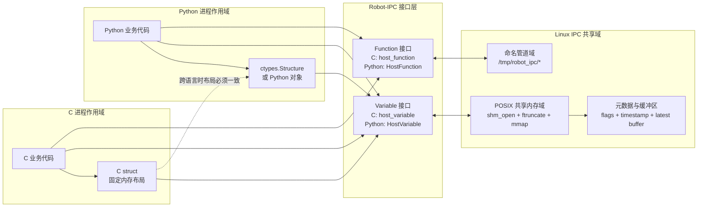

# Robot-IPC 框架设计与实现

Robot-IPC 的代码开源于 GitHub：

- https://github.com/THMOS2025/robot-ipc

本页结合本地源码目录 /Users/wegg/Documents/robotipc/robot-ipc，对 Robot-IPC 的实现原理、Linux 下的共享内存机制、topic 命名方式、数据结构约束、多进程读写流程，以及自定义数据结构的使用方式进行详细说明，并给出对应代码示例。

## 1. 项目定位

Robot-IPC 的目标不是替代 ROS 生态，也不是构建分布式中间件，而是为单机器人主机内部提供一个更轻量、更低延迟的进程间通信方案。

从源码和 README 可以看到，它围绕两个核心抽象组织：

- host_variable：跨进程共享“最新值”的共享内存变量
- host_function：跨进程调用函数的轻量 RPC 机制

其中：

- host_variable 适合 IMU、关节状态、控制指令、图像元数据等“读最新状态”的场景
- host_function 适合配置请求、一次性服务调用、状态查询等“发请求等返回”的场景

对于机器人本体内部通信，最常见也是最关键的是 host_variable，因此本页重点介绍共享内存路径。

## 2. 仓库结构与代码入口

本地仓库中与本文最相关的目录如下：

- include/host_variable.h：共享内存变量 C 接口
- src/host_variable.c：共享内存变量底层实现
- include/host_function_caller.h：远程调用客户端接口
- include/host_function_receiver.h：远程调用服务端接口
- src/host_function_caller.c：命名管道调用端实现
- src/host_function_receiver.c：epoll + 线程的服务端实现
- include/robot_ipc.hpp：C++ 封装与类型安全检查
- examples/host_variable：最简单的 topic 读写示例
- examples/host_variable_struct：结构体与变长数据示例
- examples/cross_language_structs.cpp：跨语言结构体布局示例
- docs/apis.md：官方 API 说明

从这个结构就可以看出，Robot-IPC 的核心很克制：

- 一条主线是共享内存变量
- 一条主线是命名管道函数调用
- 外层再提供 C++ 封装和示例

没有中心节点、没有发现服务、没有序列化框架、没有 QoS 协商，也没有分布式路由层。

### 2.1 整体框架流程图

下面这张图从系统视角概括了 Robot-IPC 的整体工作方式。



这张图把框架拆成三个作用域：

- C 进程作用域：业务代码在本进程里准备 C struct 或参数，然后调用 Robot-IPC。
- Python 进程作用域：业务代码在本进程里准备 ctypes.Structure 或 Python 对象，然后调用 Robot-IPC。
- Linux IPC 共享域：真正跨进程共享的是 Linux 提供的共享内存和命名管道资源。

图里最重要的边界是这一条：

- C 和 Python 调用的是同一组抽象接口，也就是 variable 和 function 这两个概念，只是各自语言里的封装名字不同。
- variable 最终都落到 Linux 共享内存域。
- function 最终都落到 Linux 命名管道域。
- 如果 C 和 Python 要通过 variable 直接互通，就必须让 Python 端使用 ctypes.Structure，并与 C struct 保持相同的字段顺序、类型和对齐方式。

## 3. Linux 中共享内存是什么

在 Linux 中，Robot-IPC 的 host_variable 基于 POSIX shared memory 实现。它的关键系统调用是：

- shm_open：创建或打开共享内存对象
- ftruncate：把共享内存对象扩展到指定大小
- mmap：把这块共享内存映射到当前进程的虚拟地址空间
- munmap：解除映射

Robot-IPC 在 src/host_variable.c 中的创建流程大致是：

1. 用 shm_open(name, O_CREAT | O_EXCL | O_RDWR, 0600) 尝试创建共享内存对象。
2. 如果发现对象已经存在，再用 shm_open(name, O_RDWR, 0600) 打开已有对象。
3. 用 ftruncate(fd, full_size) 把对象扩展到完整大小。
4. 用 mmap(..., MAP_SHARED, ...) 把它映射到进程地址空间。
5. 如果当前进程是创建者，就初始化元数据、flags 和时间戳数组。
6. 如果当前进程只是后来连接的使用者，就等待 created 标志置位，再开始访问。

这意味着多个进程虽然地址空间彼此隔离，但它们都可以把同一个共享内存对象映射到自己的地址空间中。之后的读写本质上就不再是“消息发送”，而是“对同一块物理内存的并发访问”。

这也是 Robot-IPC 延迟低的根本原因：

- 不经过网络协议栈
- 不需要 socket 收发
- 不需要中心转发进程
- 不需要对每次读取都重新分配对象

在 Linux 上，这类共享内存对象通常可以从 /dev/shm 中观察到，因此排查问题时可以直接查看：

```bash
ls -lh /dev/shm
```

## 4. host_variable 的内部内存布局

Robot-IPC 并不是简单地把一份数据直接放到共享内存里，而是设计了一套“元数据 + 多缓冲区”的布局。

在 src/config.h 中，当前缓冲区数量定义为：

```c
#define SHM_BUFFER_CNT 4
```

在 src/host_variable.c 中，共享内存对象对应的内部结构大致可以概括为：

```c
struct _s_host_variable {
	meta;                  // 创建状态等元数据
	atomic uint64_t flags; // 当前目标缓冲区 + 各缓冲区锁状态
	timestamp[4];          // 每个缓冲区对应一个时间戳
	uint8_t data[];        // 真正的数据区，按 4 份缓冲连续排布
};
```

它不是单缓冲，而是 4 份数据缓冲。这样做的目的，是让“读最新值”和“写新值”尽量少互相阻塞。

### 4.1 flags 做了什么

源码里把多个状态压缩在一个 64 位原子变量里：

- 低位的若干个 4-bit 段：记录每个缓冲区的锁计数
- 最高 4 bit：记录当前最新可读缓冲区，也就是 target

每个缓冲区的 4-bit 状态有两个用途：

- 不是 0xF 时，表示当前有多少个读者正在读这个缓冲区
- 等于 0xF 时，表示这个缓冲区被写者临时占用

这样就能在没有全局互斥锁的前提下，用原子 CAS 操作完成读写协调。

### 4.2 为什么要有时间戳

每个缓冲区还带一个时间戳。写入时会用 CLOCK_BOOTTIME 生成时间戳，并写到当前缓冲区对应的 timestamp 槽位。

这个时间戳的作用不是给用户看，而是用于内部判断“这次写入是否真的比当前最新值更新”。如果某次写入完成时发现已有更新的数据发布了，那么这次写入就不会把自己提升为最新 target。

这使得并发写入场景下，“最新数据”这个语义更稳定。


<figure class="ros-figure">
	
	<figcaption>Robot IPC 数据结构</figcaption>
</figure>


## 5. 多进程读写是怎么实现的

### 5.1 写入流程

write_host_variable 的核心逻辑可以概括为：

1. 读取 flags，找一个空闲且不是当前 target 的缓冲区。
2. 用 CAS 把该缓冲区的状态置为 0xF，表示写锁占用。
3. 把时间戳写到该缓冲区的 timestamp 槽位。
4. 把用户数据 memcpy 到该缓冲区的数据区。
5. 再次比较时间戳，如果自己仍然是最新，就把高位 target 切换到当前缓冲区。
6. 最后释放该缓冲区写锁，使之变成新的可读缓冲区。

这是一种典型的“写到新缓冲区，再原子切换最新指针”的设计。好处是：

- 读者总能看到一份完整数据
- 不会读到一半被写者改坏
- 写者不需要等待所有读者退出当前 target，直接写到另一块空闲缓冲区即可

<figure class="ros-figure">
	
</figure>
<figure class="ros-figure">
	
</figure>
<figure class="ros-figure">
	
	<figcaption>Robot IPC 写操作</figcaption>
</figure>

到这里能保证数据块不会被多个进程同时写入，但是保证不了Meta指针不会被同时写，所以我们使用原子操作对Meta指针和时间戳来进行写操作，这样就能保证多个进程不会冲突。

<figure class="ros-figure">
	
	<figcaption>Robot IPC 原子操作</figcaption>
</figure>


### 5.2 读取流程

read_host_variable 的逻辑更简单：

1. 从 flags 中读出当前 target。
2. 用 CAS 给 target 对应缓冲区的读锁计数加 1。
3. 从该缓冲区 memcpy 到用户传入的本地缓冲区。
4. 读完后把读锁计数减 1。

这个模型的关键点是：

- 读者读的是“当前最新缓冲区”的一个快照
- 读者拿到读锁后，写者不会覆盖这个缓冲区
- 读者永远不需要知道之前的历史版本

所以它天然适合机器人场景中的“只关心最新状态”问题，例如：

- 当前 IMU 姿态
- 当前关节编码器值
- 当前控制器输出
- 当前感知结果

<figure class="ros-figure">
	
	<figcaption>Robot IPC 读操作</figcaption>
</figure>

## 6. topic 在 Robot-IPC 中是什么

Robot-IPC 没有实现 ROS/DDS 那样的显式 Topic 类型系统，也没有中心注册表。在 Robot-IPC 里，所谓 topic，本质上就是一段“有名字的共享内存对象”或“有名字的函数通道”。这个名字由用户自己定义，并在所有读写进程中保持一致。例如：

- imu_state
- joint_state
- camera_front_image_meta
- gait_command
- localization_pose

对于 host_variable：

- link_host_variable(name, size) 中的 name 就是 topic 名称

对于 host_function：

- attach_host_function(name, ...) 和 link_host_function(name, ...) 中的 name 就是函数通道名称
- 源码会在 /tmp/robot_ipc/ 下创建两个 FIFO：name_req 和 name_res

也就是说，host_function 的名字最终会映射为：

```text
/tmp/robot_ipc/<name>_req
/tmp/robot_ipc/<name>_res
```

虽然框架本身只把名字当作字符串处理，但实际工程中建议统一命名规则，否则多人协作时很容易失控。建议遵循以下规则：

1. 名字稳定，不要运行时频繁变化。
2. 只使用字母、数字、下划线，避免空格和复杂符号。
3. 用模块前缀表达归属。
4. 名称体现数据含义，而不是代码实现细节。
5. 对同类数据区分“状态”“命令”“调试”。

## 7. 数据结构为什么必须受限制

其他框架比如ZMQ处理不同语言的数据的方案是序列化，但是我们不希望再引入序列化开销，所以我们自定义数据内存布局来实现跨语言通讯。host_variable 底层只是共享一块原始内存，并通过 memcpy 完成读写。因此它不会理解你的对象语义，只知道“把这几字节拷过去”。这决定了它适合的数据类型必须满足：

- 内存布局固定
- 可以直接按字节复制
- 不包含进程私有地址
- 不依赖构造函数、析构函数、虚函数等复杂语义

在 C 里，这通常意味着：基本类型、定长数组、纯 struct。在 C++ 里，源码通过 include/robot_ipc.hpp 做了编译期检查，要求类型至少满足：

- standard layout
- trivially copyable
- trivially destructible
- 不能是指针类型或引用类型

因此，下面这些类型适合直接放进 Robot-IPC：

- int、float、double
- 固定大小的数组
- 不带指针的简单 struct
- 经过 packed 处理的跨语言结构体

下面这些则不适合直接共享：

- std::string
- std::vector
- 含裸指针的结构体
- 含虚函数的类
- 依赖堆内存的复杂对象

原因很直接：例如 std::vector 里保存的是当前进程自己的堆指针，另一个进程拿到同样的字节后，指针地址并不指向有效对象。

## 8. 自定义数据结构如何设计

### 8.1 固定长度结构体

最推荐的方式是定义固定长度、无指针、无填充歧义的结构体。

例如一个 IMU topic：

```cpp
#include <cstdint>

struct __attribute__((packed)) ImuState {
	int64_t timestamp_ns;
	float quat_w;
	float quat_x;
	float quat_y;
	float quat_z;
	float gyro_x;
	float gyro_y;
	float gyro_z;
	float acc_x;
	float acc_y;
	float acc_z;
};
```

这个结构体适合直接作为一个 topic 的数据载体。

### 8.2 为什么推荐 packed

Robot-IPC 的 C++ 封装会检查“能不能安全 memcpy”，但它不能完全替你解决“跨语言或跨编译器布局是否一致”的问题。

所以当你计划让：

- C 与 C++ 互通
- C++ 与 Python 互通
- 不同编译器之间互通

最好显式使用：

- __attribute__((packed))
- 或 #pragma pack(push, 1)

这样可以避免编译器自动填充造成的字段偏移不一致。

### 8.3 变长数据结构

Robot-IPC 也支持“总容量固定，但实际写入字节数可变”的模式。examples/host_variable_struct 中就展示了这种做法。

它的关键不是直接共享真正动态对象，而是：

- 先为共享内存分配一个固定上限
- 再用 op_size 指明这次实际写入了多少字节

例如：

```c
struct __attribute__((packed)) DataFormat {
	int x;
	char y[10];
	char appendix[];
};
```

使用时需要区分两个大小：

- size：共享内存总容量
- op_size：这次真正读写的字节数

这相当于“定长缓冲区 + 可变有效载荷”的设计，适合：

- 调试字符串
- 小型二进制块
- 固定上限的额外附加信息

但这类设计需要你自己维护长度边界，因此工程里通常更建议把“长度字段”显式写进结构体。

## 9. topic 代码示例

下面给出一个最小可用的 topic 例子。它与 examples/host_variable/writer.c 和 reader.c 的风格一致，只是名字和注释做了更贴近机器人场景的整理。

### 9.1 C 语言写端

```c
#include <stdio.h>
#include "host_variable.h"

int main(void)
{
	host_variable topic = link_host_variable("imu_counter", sizeof(int));
	if (!topic) {
		perror("link_host_variable failed");
		return -1;
	}

	int value = 42;
	if (write_host_variable(topic, &value, sizeof(int), sizeof(int)) == 0)
		printf("write imu_counter = %d\n", value);

	unlink_host_variable(topic, "imu_counter", sizeof(int));
	return 0;
}
```

### 9.2 C 语言读端

```c
#include <stdio.h>
#include <unistd.h>
#include <stdbool.h>
#include "host_variable.h"

int main(void)
{
	host_variable topic = link_host_variable("imu_counter", sizeof(int));
	if (!topic) {
		perror("link_host_variable failed");
		return -1;
	}

	while (true) {
		int value = 0;
		if (read_host_variable(topic, &value, sizeof(int), sizeof(int)) == 0)
			printf("read imu_counter = %d\n", value);
		sleep(1);
	}

	unlink_host_variable(topic, "imu_counter", sizeof(int));
	return 0;
}
```

这个例子体现了 Robot-IPC 的基本使用方式：

- 写端和读端不需要谁先启动
- 两边只要 topic 名称一致、size 一致，就能连上同一块共享内存
- 读端拿到的永远是当前最新值，而不是历史消息队列

### 9.3 Python 写端与读端示例

Robot-IPC 的 Python 接口提供了更高层的 HostVariable 封装。对于纯 Python 进程之间通信，最简单的用法是直接把 Python 对象赋给 data 属性。

```python
from robot_ipc import HostVariable
import time

if __name__ == "__main__":
	topic = HostVariable("imu_status_py", max_size=4096)

	while True:
		topic.data = {
			"timestamp": time.monotonic(),
			"roll": 0.01,
			"pitch": -0.02,
			"yaw": 1.57,
		}
		time.sleep(0.01)
```

对应读端可以这样写：

```python
from robot_ipc import HostVariable
import time

if __name__ == "__main__":
	topic = HostVariable("imu_status_py", max_size=4096)

	while True:
		latest = topic.data
		print(latest)
		time.sleep(0.5)
```

这种写法最方便，但它的底层通常依赖 Python 对象的 pickle 表示，因此更适合：

- Python 进程和 Python 进程互通
- 调试阶段快速验证功能
- 数据量不大、结构变化频繁的场景

如果目标是和 C 或 C++ 进程互通，就不建议使用这种默认模式，而应该使用固定结构体布局模式。

## 10. 自定义结构体代码示例

### 10.1 C++ 固定长度结构体示例

这个例子适合机器人中最常见的状态 topic。

```cpp
#include <cstdint>
#include "robot_ipc.hpp"

struct __attribute__((packed)) JointState {
	int64_t timestamp_ns;
	float position;
	float velocity;
	float torque;
	uint8_t motor_id;
};

int main() {
	RobotIPC::HostVariable<JointState> topic("joint_state_motor_1");

	JointState out{};
	out.timestamp_ns = 1234567890;
	out.position = 1.2f;
	out.velocity = 0.3f;
	out.torque = 0.8f;
	out.motor_id = 1;

	topic.write(out);

	JointState in{};
	topic.read(in);
	return 0;
}
```

对应源码里的 C++ 封装会在编译期帮你检查这个类型是否适合做 IPC。

### 10.2 变长结构体示例

这个例子来自仓库 examples/host_variable_struct 的思路，适合“主体固定 + 尾部附加可变文本”的场景。

```c
#include <stdio.h>
#include <stdlib.h>
#include <string.h>
#include "host_variable.h"

struct __attribute__((packed)) DebugPacket {
	int code;
	char tag[16];
	char payload[];
};

int main(void)
{
	const size_t payload_capacity = 64;
	const size_t total_size = sizeof(struct DebugPacket) + payload_capacity;
	struct DebugPacket *pkt = malloc(total_size);

	pkt->code = 7;
	strcpy(pkt->tag, "walk_debug");
	strcpy(pkt->payload, "left foot slip detected");

	host_variable topic = link_host_variable("debug_packet", total_size);
	if (!topic) {
		perror("link_host_variable failed");
		return -1;
	}

	const size_t used_size = sizeof(struct DebugPacket) + strlen(pkt->payload) + 1;
	write_host_variable(topic, pkt, total_size, used_size);

	unlink_host_variable(topic, "debug_packet", total_size);
	free(pkt);
	return 0;
}
```

这里最关键的是两点：

- total_size 决定共享内存总容量
- used_size 决定本次真正写入了多少字节

如果读写双方要长期维护这类数据结构，建议再显式加入 payload_length 字段，避免只依赖字符串结束符或隐含长度规则。

### 10.3 Python 自定义结构体示例

如果是 Python 进程之间，但又希望数据结构固定、避免 pickle 带来的额外不确定性，也可以在 Python 端使用 ctypes.Structure。

```python
from robot_ipc import HostVariable
import ctypes

class JointState(ctypes.Structure):
	_pack_ = 1
	_fields_ = [
		("timestamp_ns", ctypes.c_int64),
		("position", ctypes.c_float),
		("velocity", ctypes.c_float),
		("torque", ctypes.c_float),
		("motor_id", ctypes.c_uint8),
	]

if __name__ == "__main__":
	topic = HostVariable("joint_state_motor_1", data_format=JointState)

	out = JointState()
	out.timestamp_ns = 1234567890
	out.position = 1.2
	out.velocity = 0.3
	out.torque = 0.8
	out.motor_id = 1

	topic.data = out

	latest = topic.data
	print(latest.timestamp_ns, latest.position, latest.velocity, latest.torque, latest.motor_id)
```

这种方式的价值在于：

- 字段布局固定
- 更容易和 C/C++ 对齐
- 不再依赖 Python 任意对象的序列化结果

## 11. Python / 跨语言自定义结构体示例

仓库 README、docs/python3-apis-cn.md 和 examples/host_variable_raw_python 都强调了一点：Python 与 C/C++ 互通时，必须使用固定内存布局，而不能直接共享任意 Python 对象。

### 11.1 Python API 的两种模式

Python 绑定实际上有两种工作模式：

1. 默认 Python 对象模式。
2. ctypes.Structure 固定布局模式。

默认模式下，Python 接口会把 Python 对象转换成 Python 自己可恢复的数据表示。这种方式适合 Python 之间快速互通，但它并不等价于 C 结构体的原始字节布局。

因此，C 和 Python 互通时必须遵守一个硬约束：

- 不能让 C 端直接读取 Python 默认对象模式写入的内容
- 必须让 Python 端显式声明 data_format=ctypes.Structure
- Python 结构体布局必须与 C 结构体逐字段一致

也就是说，C/Python 互通的前提不是“topic 名字一样”就够了，而是下面四项都要一致：

- topic 名字一致
- 总字节大小一致
- 字段顺序一致
- 字段类型和对齐方式一致

### 11.2 为什么默认 Python 对象不能直接和 C 互通

原因在于两边对“数据”的理解不同。

C 端的 host_variable 本质上只知道一件事：

- 从共享内存中拷出 N 个字节
- 或把 N 个字节写回共享内存

它完全不知道字节背后是不是字典、列表、字符串对象，也不知道 Python 的对象头、引用计数、指针和内部布局。

而 Python 默认对象模式下写进去的内容，并不是一个稳定的 C struct 内存布局。因此 C 端即使读到了这些字节，也无法按 struct 正确解释。

所以，C/Python 互通不是“Python 能写共享内存，C 就一定能读”，而是“Python 必须按照 C struct 的布局去写，C 才能正确读取”。

### 11.3 C 端结构体

```cpp
struct __attribute__((packed)) SensorData {
	int64_t timestamp;
	double temperature;
	double humidity;
	int sensor_id;
};
```

### 11.4 Python 端对应结构体

```python
import ctypes

class SensorData(ctypes.Structure):
	_pack_ = 1
	_fields_ = [
		("timestamp", ctypes.c_int64),
		("temperature", ctypes.c_double),
		("humidity", ctypes.c_double),
		("sensor_id", ctypes.c_int),
	]
```

只有当两端字段顺序、类型、对齐方式、总大小完全一致时，跨语言共享内存读取才是可靠的。

### 11.5 C 写入，Python 读取示例

下面的例子与仓库 examples/host_variable_raw_python 的思路一致。

先定义 C 端结构体并写入：

```c
#include <stdint.h>
#include <string.h>
#include "host_variable.h"

struct __attribute__((packed)) DataFormat {
	int x;
	char y[10];
	char appendix[32];
};

int main(void)
{
	struct DataFormat out;
	out.x = 200;
	memcpy(out.y, "python", 7);
	memcpy(out.appendix, "pypy", 5);

	host_variable topic = link_host_variable("host_variable_struct", sizeof(out));
	write_host_variable(topic, &out, sizeof(out), sizeof(out));
	unlink_host_variable(topic, "host_variable_struct", sizeof(out));
	return 0;
}
```

再在 Python 端按相同布局读取：

```python
from robot_ipc import HostVariable
import ctypes

class DataFormat(ctypes.Structure):
    _pack_ = 1
    _fields_ = [
        ("x", ctypes.c_int),
        ("y", ctypes.c_char * 10),
        ("appendix", ctypes.c_char * 32),
    ]

if __name__ == "__main__":
    topic = HostVariable("host_variable_struct", data_format=DataFormat)
    res = topic.data
    print(res.x, res.y, res.appendix)
```

这里之所以能互通，是因为：

- topic 名字都是 host_variable_struct
- C 结构体和 Python ctypes 结构体总大小相同
- 所有字段的偏移相同
- 两边都禁用了不一致的自动填充

### 11.6 Python 写入，C 读取示例

反过来也一样，Python 端可以写入 ctypes.Structure，C 端按同样布局读取。

Python 写端：

```python
from robot_ipc import HostVariable
import ctypes

class DataFormat(ctypes.Structure):
    _pack_ = 1
    _fields_ = [
        ("x", ctypes.c_int),
        ("y", ctypes.c_char * 10),
        ("appendix", ctypes.c_char * 32),
    ]

if __name__ == "__main__":
    topic = HostVariable("host_variable_struct", data_format=DataFormat)

    req = DataFormat()
    req.x = 123
    req.y = b"c_python"
    req.appendix = b"shared_memory"

    topic.data = req
```

C 读端：

```c
#include <stdio.h>
#include "host_variable.h"

struct __attribute__((packed)) DataFormat {
	int x;
	char y[10];
	char appendix[32];
};

int main(void)
{
	struct DataFormat in;
	host_variable topic = link_host_variable("host_variable_struct", sizeof(in));

	if (read_host_variable(topic, &in, sizeof(in), sizeof(in)) == 0)
		printf("x=%d y=%s appendix=%s\n", in.x, in.y, in.appendix);

	unlink_host_variable(topic, "host_variable_struct", sizeof(in));
	return 0;
}
```

### 11.7 C 和 Python 互通时的注意事项

1. Python 端必须使用 ctypes.Structure，而不是普通 dict、list、numpy 对象。
2. Python 端要设置 _pack_ = 1，对应 C 端的 packed 布局。
3. C 端尽量使用 int32_t、uint8_t、int64_t 这类固定宽度类型，避免 long 这类平台相关类型。
4. 两边必须严格使用同一个 topic 名称。
5. 两边必须使用同一个总大小；对于 Python 的 HostVariable，也要让内部使用的结构体大小与 C 端完全一致。
6. 不要在共享结构体中放指针、std::string、list 这类带间接引用的数据。
7. 读端最好一次性把 topic.data 取出到局部变量，再访问字段，避免跨多个刷新周期读取到不一致快照。

如果满足这些约束，C 和 Python 的互通本质上就变成了：

- 两边共享同一块内存
- 两边用同一份字节布局解释这块内存

这正是 Robot-IPC 支持跨语言共享的根本原理。

## 12. host_function 是怎么实现的

虽然本文重点是 topic 共享内存，但 Robot-IPC 还提供了 host_function，用于轻量级跨进程函数调用。

它并不使用共享内存，而是基于 Linux named pipe：

- 调用端：src/host_function_caller.c
- 服务端：src/host_function_receiver.c

实现方式是：

1. 调用端 link_host_function(name, sz_arg, sz_ret)。
2. 底层在 /tmp/robot_ipc/ 下打开两个 FIFO。
3. 调用端把参数写入 <name>_req。
4. 服务端线程通过 epoll 监听多个 req FIFO。
5. 收到请求后，读取参数，调用绑定函数。
6. 如果有返回值，就写入 <name>_res。
7. 调用端再从响应 FIFO 中读取返回结果。

这类机制比共享内存慢一些，但很适合：

- 配置下发
- 控制器重置
- 请求一次性计算
- 远程查询状态

它和 host_variable 的职责边界很清晰：

- 最新状态共享用 host_variable
- 请求/响应语义用 host_function

## 13. 设计上的优点与限制

### 13.1 优点

- 数据路径短，延迟低
- 只共享最新值，语义直接
- 多缓冲 + 原子状态机，适合高频读写
- 不依赖 ROS master、DDS discovery 或消息代理
- C/C++ 使用成本低

### 13.2 限制

- 没有历史消息队列
- 没有内建序列化协议
- 没有自动 schema 管理
- 读写双方必须严格约定同一个名字和同一个数据布局
- 复杂对象需要用户自己拆成可共享的平坦结构

所以它并不适合所有问题，但非常适合机器人机内“共享最新状态”的核心数据链路。

## 14. 实践建议

如果要在机器人项目中大规模使用 Robot-IPC，建议统一以下约束：

1. 先定义 topic 命名规范，再开始编码。
2. 所有共享结构体放在一个公共头文件目录统一维护。
3. 所有结构体尽量只用固定宽度整数和定长数组。
4. 需要跨语言时统一 packed 策略。
5. 大块图像数据不要直接塞进复杂对象，优先使用扁平缓冲区加元数据。
6. 对每个 topic 写清楚发布者、订阅者、刷新频率和字节大小。

这套约束看上去简单，但它恰好对应了单机器人本体内部通信最重要的目标：稳定、可控、可分析。

## 15. 小结

Robot-IPC 的核心思想非常明确：

- 用 host_variable 解决“跨进程共享最新值”
- 用 host_function 解决“跨进程请求与响应”

其中 host_variable 在 Linux 上通过 shm_open + ftruncate + mmap 建立共享内存，再结合原子 flags、多缓冲区和时间戳机制，实现低延迟、低抖动、面向最新值的数据共享。

在工程使用上，真正决定系统是否可靠的不是 API 数量，而是三件事：

- topic 名字是否统一
- 数据结构是否稳定
- 读写双方是否严格遵守同一份内存布局约定

只要这三点做得足够严格，Robot-IPC 就非常适合作为单机器人主机内部的高性能通信基础设施。
