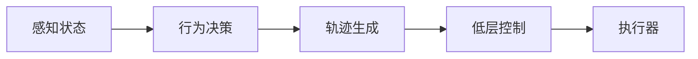

# 运动控制概览

本部分介绍机器人从基础运动学到高级行为技能的控制体系。

## 内容范围

- 运动学
- 动力学
- 状态机
- 步态控制
- Mimic
- 踢球
- AMP 行走

## 控制层次

一个典型的控制系统可分为以下几层：

1. 感知与状态估计
2. 高层行为决策
3. 轨迹或目标生成
4. 低层控制与执行

## 一个典型流程

## 建议阅读顺序

1. [运动学](kinematics.md)
2. [动力学](dynamics.md)
3. [状态机](state-machine.md)
4. [步态控制](gait.md)
5. [Mimic](mimic.md)
6. [踢球](kicking.md)
7. [AMP 行走](amp.md)