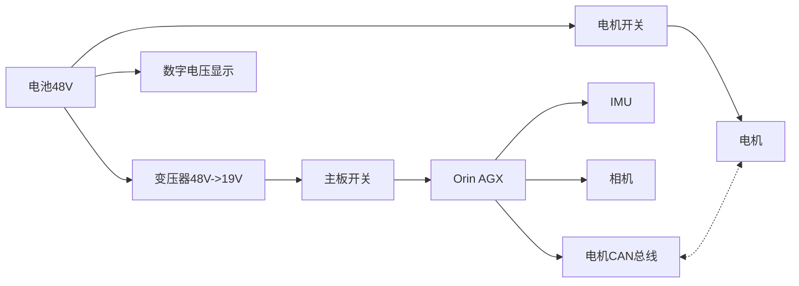

# 电路设计及PCB制作

## 电路设计
上一节梳理了电路设计需求，我们电路需求如下框图：

第一版设计的时候我们直接采用NMOS管做开关；买的变压器用于电压转换（模块支持30-60V输入，19V、5A输出）。这个电路在电流比较小的情况下可以稳定实现他的功能，但是由于20个电机峰值电流比较大，而且会有浪涌电流，导致MOS管开关多次会被烧坏。

<figure class="ros-figure ros-figure--narrow">
    
    <figcaption>电路原理图V1</figcaption>
</figure>

    <figure class="ros-figure ros-figure--paired">
        
        <figcaption>PCB Layout V1</figcaption>
    </figure>
    <figure class="ros-figure ros-figure--paired">
        
        <figcaption>PCB实物图V1</figcaption>
    </figure>

第二版设计加入了一个继电器,电路变稳定了一些，但是在接入电池的时候还是会击穿继电器。下一版再想想办法。

<figure class="ros-figure ros-figure--narrow">
    
    <figcaption>电路原理图V2</figcaption>
</figure>

    <figure class="ros-figure ros-figure--paired">
        
        <figcaption>PCB Layout V2</figcaption>
    </figure>
    <figure class="ros-figure ros-figure--paired ros-gallery--pair-full">
        
        <figcaption>PCB实物图V2</figcaption>
    </figure>

由于电机需要4路CAN总线，所以我们买了一个CAN转接板，XT60输入电流，其他四个CAN+电源线的接口接4路电机。这个板子的CAN信号线和电机信号线刚好相反，所以第一个电机连线需要把信号线反过来。然后4路CAN信号转成USB连接到主板上。

如下为变压器、继电器、电池、CAN转接板。

    <figure class="ros-figure">
        
        <figcaption>变压器</figcaption>
    </figure>
    <figure class="ros-figure">
        
        <figcaption>继电器</figcaption>
    </figure>
    <figure class="ros-figure">
        
        <figcaption>电池</figcaption>
    </figure>
    <figure class="ros-figure">
        
        <figcaption>CAN转接板</figcaption>
    </figure>

