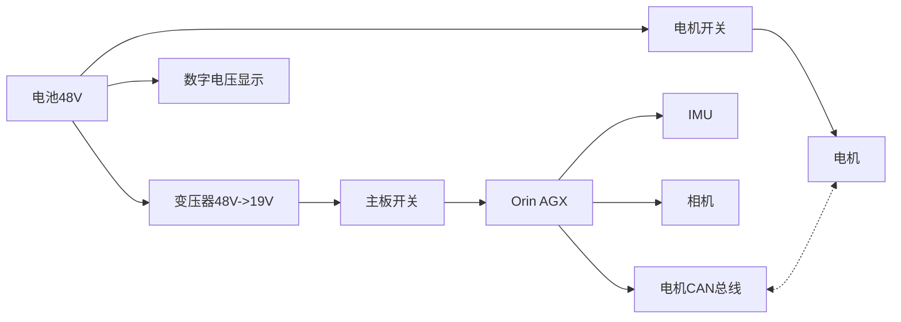
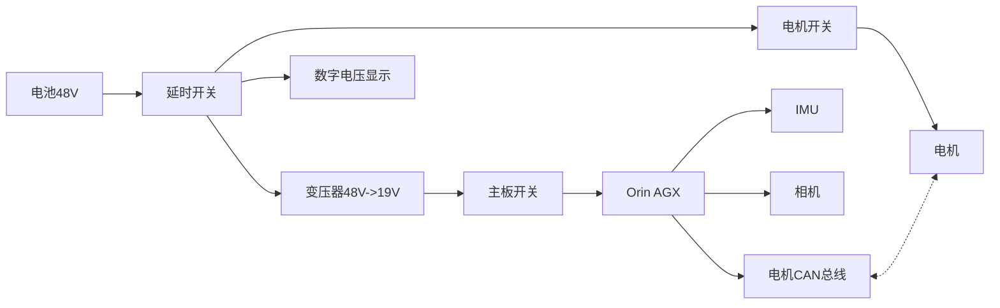
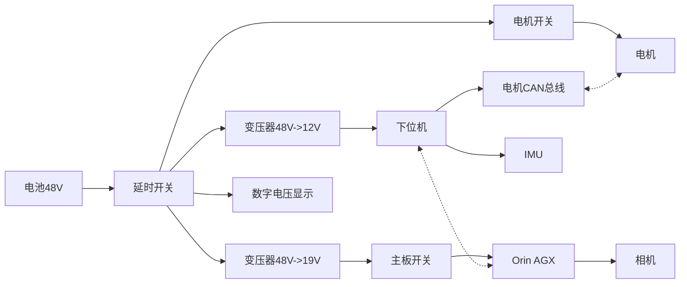

# 电路系统概览

本部分介绍机器人电路系统的模块划分、关键器件与安全边界。

## 总体设计
电路可以说是我们设计的最弱的一部分，因为这个太需要工程经验了，而且在华子基本不教怎么设计电路，PCB都是自己现学的。所以本章仅供参考。

机器人中有不同的设备需要供电，分别有电机（电压24V、36V、48V，单电机电流0-2A），主板（电压12V、19V，电流0-5A），传感器比如IMU（3.3V、5V）、摄像头（3.3V、5V），可能还有扬声器、灯带等设备，但是这些都可以用主板供电。不同设备有不同的电压、电流需求，所以机器人供电电路需要提供不同的电压。由于IMU、摄像头以及5V及以下供电的设备都可以通过连接主板来供电（USB或排针），所以供电电路最主要的就是考虑给电机和主板供电。

我们的电机选用ENCOS电机，供电电压都是48V，主板选用NVIDIA Jetson Orin AGX，供电电压是19V，所以我们的电路框架如下，其中虚线表示信号线连接。

这个电路的核心在于变压器和开关要怎么做。由于电机电流可能比较大，20个电机电流可能在10-30A，如果用机械开关会起电弧导致开关和设备损坏。我们尝试了两个电子开关的方案，最后选用继电器作为开关。继电器控制端采用降压后的19V。变压器我们买的现成的模块。但是我们的方案比较粗糙，有能力还是自己设计模块比较好，但是总体框架是没问题的。

上面的框架有一点小问题，就是机器人电池会不断拆卸，如果每次接入都是通路，接入时还是有火花，所以最好在入端加入一个控制电路，接一个触发器，可以通过按键3秒以上来接通电路。

还有一个可能的需求，如果你的机器人是上下位机的结构（上下位机介绍在通讯/概览部分有介绍），则需要根据下位机电压需求再加一路分压，因为上位机一般无法直接给下位机供电。上下位机可以用CAN、网线等方式连接。

