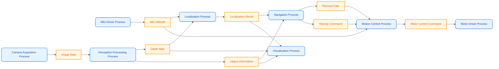

# Communication Framework Overview

This section introduces the design of external communication for sensors in the robot system and internal communication within the host.

## Sensor Physical Communication

Most robot systems are equipped with a **host computer**, which is responsible for running the robot operating system such as ROS 2, motion control, state estimation, path planning, visual perception, neural network inference, and other tasks, while also collecting data from various sensors and sending control commands to motor drivers.

The host computer typically uses a high-performance computing platform running an operating system such as Linux, for example the NVIDIA Jetson series (Orin Nano, Orin NX, AGX Orin), an x86 industrial PC, or an Intel motherboard. For robots with relatively simple functions, a single-board computer such as a Raspberry Pi can also be used as the host computer.

Some robots also add an **embedded controller**. The embedded controller usually uses an MCU such as STM32, a DSP, or another real-time controller. It is mainly responsible for communicating with hardware such as motor drivers, encoders, IMUs, and force sensors, and for executing high-frequency real-time tasks such as joint-level position, velocity, or torque control, data acquisition, safety protection, and fault detection. The host computer exchanges data with the embedded controller through communication buses such as CAN, EtherCAT, UART, SPI, USB, or Ethernet, sends control targets, and retrieves robot state information.

The main advantage of using an embedded controller is that it usually runs bare-metal software or a real-time operating system (RTOS), which provides lower interrupt response latency and stronger real-time performance, allowing it to execute millisecond-level control tasks reliably. At the same time, the embedded controller can take over low-level device communication and real-time control, reducing the burden on the host computer and improving system reliability and maintainability. However, because data communication is required between the host computer and the embedded controller, some communication latency is introduced. With a well-designed communication protocol and control architecture, this overhead is usually small.

<div class="grid cards" markdown>

- ### Single host computer

    ```mermaid
    flowchart LR
        A[Sensors]
        B[Host Computer<br/>Jetson / Intel]
        C[Control Algorithms]
        D[Motor Drivers]

        A --> B
        B --> C
        C --> B
        B --> D
    ```

- ### Host computer + embedded controller

    ```mermaid
    flowchart LR
        A[Sensors]
        B[Embedded Controller<br/>STM32]
        C[Host Computer<br/>Jetson]
        D[Control Algorithms]
        E[Motor Drivers]

        A --> B
        B --> E
        B <-->|CAN / EtherCAT| C
        C --> D
        D --> C
    ```

</div>

However, the embedded controller is not a mandatory part of a robot system. Whether it is used depends on the robot's control requirements, hardware configuration, and system complexity. As modern processors continue to improve and real-time technologies such as the Linux real-time kernel (PREEMPT_RT), EtherCAT, and CAN FD continue to mature, many robots are now able to complete the entire control pipeline using a **single-host architecture**. In this architecture, the host computer communicates directly with sensors and motor drivers while also running state estimation, motion control, perception, and decision-making algorithms, which is sufficient for many research platforms, educational robots, and open-source robots.

MOS9 uses a single-host architecture, with the NVIDIA Jetson Orin as the core control platform, directly handling sensor data acquisition, motor driver communication, and robot motion control. This solution has a simple structure, low hardware cost, and convenient development and debugging, while still meeting the real-time requirements of this robot control system, so no additional embedded controller was designed.

There are many ways to communicate with sensors, including USB, CAN, serial communication, and so on. Today, most sensors are highly integrated, and most of them can communicate over USB, so our final communication framework is designed as follows:

<figure class="ros-figure ros-figure--narrow">
    
    <figcaption>Communication framework</figcaption>
</figure>


## Inter-Process Communication

Inter-process communication refers to data exchange among different processes inside the host. In a robot system, multiple kinds of sensor information are typically used, such as images, IMU data, driver signals, microphone data, and so on. There are also intermediate results, such as depth maps produced from stereo image processing, recognized object information, localization results, and so forth. The size of these data can vary greatly. For example:

- Floating-point depth maps or point cloud data with a resolution of 1920×1080
- int8 image data with a resolution of 1920×1080
- IMU attitude quaternions made up of 4 floating-point values
- CAN frames from 20 motors, for example a 20×64-byte block of data

These messages often need to be read, processed, and forwarded among multiple processes, and the same piece of information is often shared by multiple processes. For example, both the motion control module and the navigation module may need to read IMU attitude data at the same time. Therefore, in robot software architecture design, how to efficiently organize communication across multiple processes, manage messages of different types and sizes, and support concurrent access by multiple modules is a very important issue.

The following diagram shows several common processes in a robot system and how they communicate through messages. Rounded boxes represent processes, and rectangular boxes represent messages.



In robot software development, many people naturally prioritize communication frameworks such as ROS, DDS, and ZMQ. These frameworks are mainly designed for distributed node communication scenarios and have clear advantages in multi-machine collaboration, remote control, cross-device deployment, and complex system integration. However, if the system boundary is limited to a single robot body and does not involve multi-robot communication, remote control, or distributed computing, then many of the capabilities provided by such frameworks are not actually essential. On the contrary, the extra abstraction layers, serialization overhead, and scheduling complexity they introduce may make system design heavier and can even become overengineering.

For communication inside a robot host, the more important goals are usually high frequency, low latency, and low jitter. Especially in scenarios such as state synchronization, perception result sharing, and motion control, the simpler and more direct the communication mechanism is, the easier it often is to achieve better real-time performance. Therefore, shared memory, lock-free queues, and even intra-process function calls are usually more efficient implementation choices. Based on these requirements, we implemented a lightweight robot communication middleware. This middleware focuses only on communication inside the robot host and uses shared memory as its sole mechanism, enabling low-latency, high-bandwidth inter-process data transfer. For more details, see the Robot-IPC chapter.


