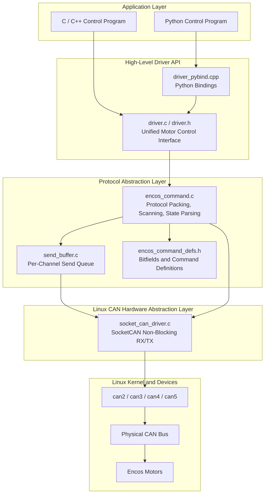
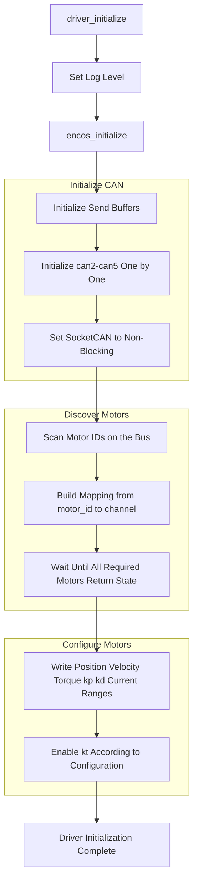
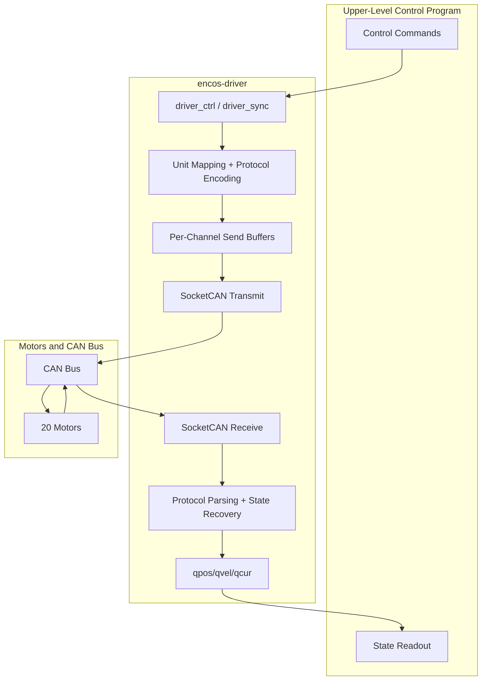

# Motor CAN Communication Driver

One of the most important communication components on a robot is motor communication. For other sensor interfaces such as cameras and IMUs, official programs are usually provided, so this section focuses on analyzing the motor communication design. This page examines the motor CAN communication driver library used by MOS9, [Github: encos-driver](https://github.com/THMOS2025/encos-driver.git), and explains its design process as well as the implementation details of the library.

This library is a high-level SocketCAN driver wrapped on Linux. It drives 20 motors over 4 CAN buses and provides the following functions:

- Automatically bring up CAN network interfaces
- Scan ENCOS motors on the bus
- Encode high-level control variables such as position, velocity, torque, kp, and kd into motor protocol frames
- Recover state values such as position, velocity, and current from motor feedback frames
- Provide a unified C API upward
- Expose the same high-level driver interface to Python through pybind11

This library is not a general-purpose CAN utility library. Instead, it is a “motor control driver layer” customized for the ENCOS motor protocol. We have wrapped the CAN frames so that upper-layer control programs can work directly with “joint states” and “joint control values.” This library serves as an application example of how to write a motor communication program for robot developers.

## 1. Overall Positioning

The core value of this library is that it hides three kinds of complexity inside the driver:

- The complexity of Linux SocketCAN device operations
- The complexity of the motor's private binary protocol
- The complexity of synchronized control across multiple motors and multiple channels

As a result, upper-layer callers do not need to directly manage:

- `PF_CAN` raw sockets
- `bind`, `ioctl`, `fcntl`
- Packing control values into bitfields
- Motor scanning and ID mapping
- Parsing state frames and restoring physical units

Upper-layer code only needs to use the following interfaces, which are convenient for the motion control part to call:

- `driver_initialize()`
- `driver_ctrl()`
- `driver_sync()`
- `driver_get_pos()` / `driver_get_vel()` / `driver_get_cur()`


## 2. Overall Architecture

Judging from the source tree, this library can be divided into four layers.



This diagram reflects two very important design points:

1. The Python side does not manipulate CAN directly. Instead, it uses pybind11 to call the same high-level interface in `driver.c`.
2. The motor protocol implementation is separated from the Linux SocketCAN implementation. The former is responsible for “motor semantics,” while the latter is responsible for “bus send/receive.”

## 3. Code Structure and Responsibility Split

### 3.1 High-Level Driver Interface Layer

The high-level entry points are in `include/driver.h` and `src/driver.c`.

The main interfaces it exposes are:

- `driver_initialize()`
- `driver_uninitialize()`
- `driver_ctrl()`
- `driver_sync()`
- `driver_set_zero()`
- `driver_set_id()`
- `driver_send_query()`
- `driver_get_pos()`
- `driver_get_vel()`
- `driver_get_cur()`

The role of this layer is to uniformly abstract all motor control as “a group of arrays for 20 joints.” For example, `driver_ctrl()` receives five arrays of length `MOTOR_COUNT` at a time:

- `kp[]`
- `kd[]`
- `target_pos[]`
- `target_vel[]`
- `target_tor[]`

This means its interface is designed not as “send commands one motor at a time,” but as “send commands for one full control cycle of the entire robot.” This fits the usage pattern of robot control loops very well.

### 3.2 Protocol Abstraction Layer

The protocol layer is concentrated in:

- `src/encos/encos_command.c`
- `src/encos/encos_command_defs.h`

This layer is responsible for:

- Mapping high-level control variables into motor protocol bitfields
- Managing which CAN channel each motor belongs to
- Scanning the bus and discovering motors
- Parsing different types of motor response frames
- Maintaining the current motor state cache

This is the most central layer in the entire library, because it elevates “CAN send/receive” into a “motor control protocol.”

### 3.3 Send Buffer Layer

The send buffer is implemented in `src/send_buffer.c`.

It maintains a ring queue for each channel:

- `CHANNEL_COUNT = 4`
- `SEND_BUFFER_SIZE = 1024`

Its purpose is to temporarily store outgoing CAN frames generated by the protocol layer on a per-channel basis, and then flush them to the bus in a unified way through `push_msg()`.

This design has two benefits:

- The protocol layer can first prepare a complete round of multi-motor transmissions and then send them out centrally
- The send order on each channel is preserved, so it is not directly scrambled by upper-layer call order

### 3.4 SocketCAN Hardware Abstraction Layer

The hardware layer is in:

- `src/socket_can_driver.c`
- `src/socket_can_driver.h`

This layer is the part closest to Linux. It is mainly responsible for:

- `socket(PF_CAN, SOCK_RAW, CAN_RAW)` to create raw CAN sockets
- `ioctl(..., SIOCGIFINDEX, ...)` to resolve interface indexes by interface name
- `bind()` to bind a socket to a specified `canX`
- `fcntl(..., O_NONBLOCK)` to set non-blocking mode
- `read()` / `write()` to complete CAN frame receive and transmit

In addition, during initialization it will try to automatically bring up CAN interfaces through:

```bash
sudo ip link set canX up type can bitrate 1000000 loopback off
```

Therefore, the user running the program must have the corresponding permissions.

## 4. System Constants and Runtime Scale

From `src/constant.h` and `src/constant.c`, we can see that the driver currently assumes:

- `MOTOR_COUNT = 20`
- `CHANNEL_COUNT = 4`
- `SEND_BUFFER_SIZE = 1024`
- The default CAN interfaces are `can2`, `can3`, `can4`, and `can5`

This shows that it is not a fully generic library for arbitrary device scales. It has already been engineering-configured for the target robot.

In addition, all 20 motors in `MUST_ONLINE_MOTOR` are currently set to `true`, which means the initialization stage assumes by default that all motors must be online.

## 5. Initialization Flow

The initialization entry is `driver_initialize()`. It is itself very thin, and the real core logic is in `encos_initialize()`.

The overall initialization flow is as follows.



### 5.1 Initializing CAN Channels

`encos_initialize()` calls `initialize_can(i)` in sequence.

Each channel initialization performs the following steps:

1. Check whether the channel number is valid.
2. If the channel is already initialized, return directly.
3. Execute `ip link set canX up ...` to bring up the device.
4. Create a `PF_CAN` raw socket.
5. Set it to `O_NONBLOCK`.
6. Obtain the interface index through `ioctl`.
7. `bind` it to the corresponding `canX` device.

This shows that the driver chooses a “non-blocking polling” model rather than a blocking wait model.

### 5.2 Scanning Motors

The scanning logic is in `scan_motors()`.

It broadcasts the `query_id` command on each available channel, then reads the replies from each channel to determine:

- Which motors exist
- Which CAN channel a particular motor ID is on

The core internal state it maintains includes:

- `channel_available[]`
- `motor_to_channel[]`
- `motor_found[]`
- `motor_error[]`

Among them, `motor_to_channel[id]` is especially important because it is the routing basis for all subsequent single-motor commands.

### 5.3 Waiting for Motors to Come Online

Discovering IDs alone is not enough. The driver also enters `wait_motors_online()`, repeatedly querying positions until either:

- All motors that must be online have returned valid positions
- Or a timeout occurs

This step effectively upgrades “bus discovery” into “the motor is truly communicable.”

### 5.4 Sending Range Configuration

After initialization succeeds, `driver_initialize()` calls:

- `encos_set_pos_range()`
- `encos_set_vel_range()`
- `encos_set_tor_range()`
- `encos_set_cur_range()`
- `encos_set_kp_range()`
- `encos_set_kd_range()`
- `encos_enable_kt()`

These ranges come from compile-time constants in `src/constant.c`.

This means the driver is not simply passing through an SDK. It maintains a set of “physical range configurations” used for the bidirectional mapping of control values and feedback values.

## 6. How Control Commands Are Encoded into CAN Frames

This is the most noteworthy part of the entire driver.

In `encos_command_defs.h`, the driver defines one 64-bit CAN data frame as multiple bitfield structures. For control commands, the core definition is:

```c
struct {
	uint qtor: 12;
	uint qvel: 12;
	uint qpos: 16;
	uint kd:    9;
	uint kp:   12;
	uint mode:  3;
} ctrl;
```

This means that one 8-byte control frame actually packs:

- `kp`: 12 bits
- `kd`: 9 bits
- `qpos`: 16 bits
- `qvel`: 12 bits
- `qtor`: 12 bits
- `mode`: 3 bits

Before sending, the high-level control values are first linearly mapped:

- The actual position range `pos_range[id]` is mapped to `0 ~ 65535`
- The actual velocity range `vel_range[id]` is mapped to `0 ~ 4095`
- The actual torque range `tor_range[id]` is mapped to `0 ~ 4095`
- `kp` is mapped to `0 ~ 4095`
- `kd` is mapped to `0 ~ 511`

In other words, the library exposes continuous physical quantities to users, while what is transmitted over the network is discretized integer encoding constrained by bit width.

### 6.1 Control Sending Flow

`driver_ctrl()` calls `encos_ctrl()`, which loops over motors and performs the following steps:

1. Check whether the motor has a recent heartbeat.
2. Check whether the motor has reported an error code.
3. Map `kp/kd/pos/vel/tor` into integers.
4. Use the `COMMAND_CTRL(...)` macro to assemble a 64-bit CAN payload.
5. Push that frame into the send buffer of the channel where the motor resides.
6. Flush multi-channel buffers together through `push_msg()`.

This means one call to `driver_ctrl()` essentially completes “packet assembly and transmission of one round of control frames for all motors on the robot.”

## 7. How State Feedback Is Parsed

After receiving frames, the library does not return them directly to the user. Instead, the protocol layer first performs multiple kinds of response parsing.

The core parsing functions include:

- `parse_query_id()`
- `parse_set_id()`
- `parse_set_zero()`
- `parse_set_range()`
- `parse_enable_kt()`
- `parse_response_1()`
- `parse_response_4()`
- `parse_response_5()`

Among them, the most important part is state feedback:

### 7.1 `response_1`

`response_1` is the regular state frame, which contains:

- `position`
- `velocity`
- `current`
- `motor_temp`
- `mos_temp`
- `error_no`

After receiving this type of frame, the driver converts the raw integer values back into floating-point physical quantities through `unmap()` and writes them into:

- `current_qpos[]`
- `current_qvel[]`
- `current_qcur[]`

These three arrays are the underlying state cache returned upward by `driver_get_pos()`, `driver_get_vel()`, and `driver_get_cur()`.

### 7.2 `response_5`

`response_5` appears to be an extended reply for some query commands. The codes currently supported by the driver mainly include:

- code = 1: position
- code = 2: velocity

It also converts angle values from degrees to radians and rotational speed values to radians per second.

### 7.3 Errors and Timeouts

Whenever a frame is received from a motor, the driver updates `motor_last_seen_time[id]`.

In `encos_ctrl()`, if a motor has not been seen for more than 1 second, it is considered timed out and disconnected:

- The motor is removed from the mapping table
- If it belongs to the set of motors that must be online, `MOTOR_TIMEOUT` is returned

In addition, if `error_no != 0` in a feedback frame, the driver records the error code. During subsequent control, if that motor still has an error, it returns `MOTOR_ERROR`.

## 8. Send Buffer and Channel Scheduling

`send_buffer.c` implements a simple but practical design: one ring send queue per channel.

### 8.1 Why a Send Buffer Is Needed

If the protocol layer directly called `write()` on the CAN socket while iterating over motors, several problems would arise:

- It would be hard to organize send order uniformly in multi-channel control
- When one channel is briefly congested, the logic layer would have difficulty continuing to organize commands for other motors
- When configuration commands and control commands are mixed together, it becomes hard to guarantee the integrity of batch operations

So the design here is to call `send_buffer_push()` first and then flush everything in batches through `push_msg()`.

### 8.2 How `push_msg()` Works

`push_msg()` loops over all channels:

- If a channel buffer is not empty, it pops one frame and sends it
- If all channel buffers are empty, it exits
- After each round of the loop, it calls `usleep(100)` to avoid tight busy-waiting

This is a simple polling scheduler. It does not implement complex priorities, but at the current scale of 20 motors and 4 channels, it is already sufficient for engineering use.

## 9. The Meaning of `driver_sync()`

The implementation of `driver_sync()` is very direct:

1. `encos_query(1)`
2. `encos_query(2)`
3. Wait about 1 ms
4. `pull_msg()` to fetch and parse the replies

In other words, it is not acting as a synchronization barrier. Instead, it actively initiates one round of state queries and then refreshes the local cache with the returned feedback.

Therefore, semantically at the system level, `driver_sync()` is closer to:

- “Actively refresh the state cache”

rather than:

- “Strict clock synchronization”

## 10. Relationship Between the C and Python Interfaces

The Python interface of this library is not independently implemented. In essence, it is a pybind11 wrapper around `driver.h`.

In other words:

- The C side calls `driver_initialize()`
- The Python side calls `encos_python.initialize()`

Both ultimately go to the same implementation in `driver.c`.

The approximate correspondence is as follows:

| C API | Python API | Description |
|---|---|---|
| `driver_initialize()` | `initialize()` | Initialize the driver |
| `driver_uninitialize()` | `uninitialize()` | Shut down the driver |
| `driver_ctrl()` | `ctrl()` | Send control values for all motors in one shot |
| `driver_sync()` | `sync()` | Actively fetch state |
| `driver_get_pos()` | `get_pos()` | Get the position array |
| `driver_get_vel()` | `get_vel()` | Get the velocity array |
| `driver_get_cur()` | `get_cur()` | Get the current array |
| `driver_set_zero()` | `set_zero()` | Set zero |
| `driver_set_id()` | `set_id()` | Change ID |
| `driver_send_query()` | `send_query()` | Send a query command |

As a result, the language-boundary design of this library is very clean:

- C / C++ / Python share the same high-level motor semantics
- There is only one copy of the protocol implementation
- There is also only one copy of the hardware driver implementation

In the Python binding, `get_pos()`, `get_vel()`, and `get_cur()` also return read-only NumPy arrays that directly reference the underlying state memory, reducing one extra copy.

## 11. Control and Feedback Data Flow

The following diagram shows both the command flow and the feedback flow in one control cycle.



This diagram reveals a very important fact:

- What the upper-layer program sees are “array-based control” and “array-based state”
- The middle driver takes responsibility for all “protocol encoding, channel scheduling, and feedback parsing”

Therefore, this library is naturally well suited as the middle layer between the full-robot controller and the actuators.

## 12. Advantages of the Library

From an engineering perspective, this library has several obvious advantages.

### 12.1 Clean High-Level Interface

The upper layer controls motors directly with floating-point physical quantities and does not need to care about CAN bitfields.

### 12.2 C and Python Share the Same Implementation

This avoids divergence between two separate control logic implementations and reduces maintenance cost.

### 12.3 Separation Between the Protocol Layer and the Hardware Layer

If support for another motor protocol is needed in the future, the protocol layer could theoretically be rewritten. If a different bus send/receive implementation is needed, the hardware layer could also be replaced.

### 12.4 Suitable for the Full-Robot Control Loop

The input to `driver_ctrl()` is an array for all 20 motors on the robot, which matches the typical output form of a robot controller very well.

## 13. Current Limitations and Points to Note

Although this library is practical, there are still some limitations that should be stated clearly.

### 13.1 Configuration Is Fixed at Compile Time

For example:

- Number of motors
- Number of channels
- Default CAN interface names
- Range configuration
- Set of motors that must be online

At present, these are all fixed in `constant.c` and are not runtime-configurable.

### 13.2 Initialization Depends on System Permissions

The driver internally executes `sudo ip link set ...`, which means:

- The running user must have permission
- In some restricted deployment environments, this may not be an appropriate approach

In stricter engineering practice, network interface configuration is usually placed in systemd, startup scripts, or the operations layer rather than inside the driver library itself.

### 13.3 The Non-Blocking Polling Model Is Relatively Simple

The current implementation relies on:

- Non-blocking sockets
- Periodic `pull_msg()`
- Simple buffer polling

This approach is straightforward enough, but it is not the optimal implementation for strong real-time behavior or event-driven design.

### 13.4 Error Recovery Is Relatively Basic

For example, after a motor is lost, the current strategy mainly is:

- Mark it as disconnected
- Return an error
- Exit directly when necessary

But there is no more complete mechanism for automatic reconnection, graded degradation, or local isolation.

## 14. Summary

The essence of encos-driver can be summarized in one sentence:

It is a Linux SocketCAN high-level driver for Encos motors that elevates raw CAN bus communication into a “full-robot multi-motor joint control interface.”

Its key internal work includes:

- Initializing and bringing up CAN devices
- Scanning and discovering motors
- Maintaining the mapping from motor IDs to CAN channels
- Encoding physical control values into motor protocol frames
- Restoring motor feedback frames into position, velocity, and current states
- Providing services upward through a unified C API and Python API

For robot systems, this kind of driver layer is very important because it extracts “motor communication” out of the controller, allowing upper-layer control programs to focus on:

- Gait planning
- State estimation
- Motion control
- Reinforcement learning policy deployment

without having to directly deal with the details of low-level CAN frames.
