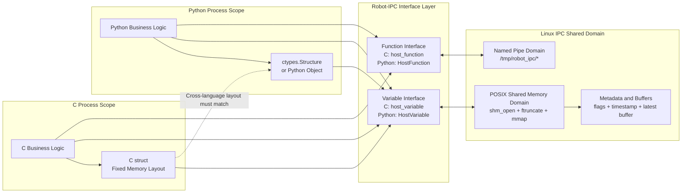

# Robot-IPC Framework Design and Implementation

The code of Robot-IPC is open-sourced on GitHub: [Robot-IPC](https://github.com/THMOS2025/robot-ipc). In this section, we combine the source code with a detailed explanation of Robot-IPC's implementation principles, the shared-memory mechanism on Linux, topic naming, data structure constraints, multi-process read/write flow, and how to use custom data structures, along with corresponding code examples.

## 1. Project Positioning

The goal of Robot-IPC is not to replace the ROS ecosystem or build distributed middleware, but to provide a lighter and lower-latency inter-process communication solution inside a single robot host.

From the source code and README, we can see that it is organized around two core abstractions:

- host_variable: a shared-memory variable that shares the “latest value” across processes
- host_function: a lightweight RPC mechanism for cross-process function invocation

Among them:

- host_variable is suitable for scenarios that read the latest state, such as IMU data, joint states, control commands, and image metadata
- host_function is suitable for “send a request and wait for a reply” scenarios such as configuration requests, one-shot service calls, and state queries

For communication inside a robot body, the most common and most critical mechanism is host_variable, so this page focuses on the shared-memory path.

## 2. Repository Structure and Code Entry Points

In the local repository, the directories most relevant to this page are as follows:

- include/host_variable.h: C interface for shared-memory variables
- src/host_variable.c: low-level implementation of shared-memory variables
- include/host_function_caller.h: client interface for remote invocation
- include/host_function_receiver.h: server interface for remote invocation
- src/host_function_caller.c: caller implementation based on named pipes
- src/host_function_receiver.c: server implementation using epoll + threads
- include/robot_ipc.hpp: C++ wrapper and type-safety checks
- examples/host_variable: the simplest topic read/write example
- examples/host_variable_struct: examples of structs and variable-length data
- examples/cross_language_structs.cpp: examples of cross-language struct layout
- docs/apis.md: official API documentation

This structure makes Robot-IPC's core philosophy obvious:

- One main line is shared-memory variables
- One main line is named-pipe function calls
- On the outside, C++ wrappers and examples are provided

There is no central node, no discovery service, no serialization framework, no QoS negotiation, and no distributed routing layer.

### 2.1 Overall Framework Flow Diagram

The following diagram summarizes how Robot-IPC works from a system perspective.



This diagram splits the framework into three scopes:

- C process scope: business code prepares C structs or arguments inside the current process and then calls Robot-IPC.
- Python process scope: business code prepares ctypes.Structure objects or Python objects inside the current process and then calls Robot-IPC.
- Linux IPC shared domain: the actual cross-process sharing is provided by Linux shared memory and named pipe resources.

The most important boundary in the diagram is this:

- C and Python call the same pair of abstract concepts, namely variable and function, but the wrapper names differ by language.
- variable always ends up in the Linux shared-memory domain.
- function always ends up in the Linux named-pipe domain.
- If C and Python want to interoperate directly through variable, the Python side must use ctypes.Structure and keep the same field order, types, and alignment as the C struct.

## 3. What Shared Memory Is on Linux

On Linux, Robot-IPC's host_variable is implemented with POSIX shared memory. Its key system calls are:

- shm_open: create or open a shared memory object
- ftruncate: resize the shared memory object to a specified size
- mmap: map that shared memory into the current process's virtual address space
- munmap: unmap it

In `src/host_variable.c`, the creation flow of Robot-IPC is roughly:

1. Use `shm_open(name, O_CREAT | O_EXCL | O_RDWR, 0600)` to try to create a shared-memory object.
2. If the object already exists, use `shm_open(name, O_RDWR, 0600)` to open the existing object.
3. Use `ftruncate(fd, full_size)` to extend the object to the full size.
4. Use `mmap(..., MAP_SHARED, ...)` to map it into the process address space.
5. If the current process is the creator, initialize the metadata, flags, and timestamp arrays.
6. If the current process is just a later user connecting to it, wait until the created flag is set before starting access.

This means that although multiple processes have isolated address spaces, they can all map the same shared-memory object into their own address spaces. After that, reading and writing are no longer “message sending,” but “concurrent access to the same block of physical memory.”

This is also the fundamental reason why Robot-IPC has low latency:

- It does not go through the network protocol stack
- It does not require socket send/receive
- It does not require a central forwarding process
- It does not need to allocate a new object for every read

On Linux, such shared-memory objects can usually be observed under /dev/shm, so during troubleshooting you can inspect them directly:

```bash
ls -lh /dev/shm
```

## 4. The Internal Memory Layout of host_variable

Robot-IPC does not simply place one piece of data directly into shared memory. Instead, it designs a layout of “metadata + multiple buffers.”

In `src/config.h`, the current number of buffers is defined as:

```c
#define SHM_BUFFER_CNT 4
```

In `src/host_variable.c`, the internal structure corresponding to a shared-memory object can be summarized roughly as:

```c
struct _s_host_variable {
	meta;                  // Creation status and other metadata
	atomic uint64_t flags; // Current target buffer + lock state of each buffer
	timestamp[4];          // One timestamp for each buffer
	uint8_t data[];        // Actual data area, laid out as 4 consecutive buffers
};
```

It is not single-buffered, but uses 4 data buffers. The purpose of doing this is to reduce interference between “read the latest value” and “write a new value” as much as possible.

### 4.1 What flags Does

In the source code, multiple states are compressed into one 64-bit atomic variable:

- The low-order 4-bit segments record the lock count of each buffer
- The highest 4 bits record the current latest readable buffer, namely the target

The 4-bit state of each buffer has two purposes:

- When it is not `0xF`, it indicates how many readers are currently reading this buffer
- When it equals `0xF`, it indicates that this buffer is temporarily occupied by a writer

In this way, read/write coordination can be completed with atomic CAS operations without a global mutex.

### 4.2 Why Timestamps Are Needed

Each buffer also carries a timestamp. During writes, `CLOCK_BOOTTIME` is used to generate a timestamp, which is then written into the timestamp slot corresponding to the current buffer.

The purpose of this timestamp is not for direct display to users, but for internal judgment of whether “this write is actually newer than the current latest value.” If a write finishes and detects that newer data has already been published, then this write will not promote itself to the latest target.

This makes the semantics of “latest data” more stable in concurrent-write scenarios.


<figure class="ros-figure">
	
	<figcaption>Robot IPC data structure</figcaption>
</figure>


## 5. How Multi-Process Reading and Writing Is Implemented

### 5.1 Write Flow

The core logic of write_host_variable can be summarized as:

1. Read flags and find a buffer that is idle and not the current target.
2. Use CAS to set that buffer's state to `0xF`, indicating a write lock.
3. Write the timestamp into the corresponding timestamp slot of that buffer.
4. `memcpy` the user data into that buffer's data area.
5. Compare timestamps again. If this write is still the latest, switch the high-bit target to the current buffer.
6. Finally release the write lock on that buffer so it becomes the new readable buffer.

This is a typical “write into a new buffer, then atomically switch the latest pointer” design. The benefits are:

- Readers always see a complete piece of data
- They do not read half-written data corrupted by a writer
- Writers do not need to wait for all readers to leave the current target, but can directly write into another idle buffer

<figure class="ros-figure">
	
</figure>
<figure class="ros-figure">
	
</figure>
<figure class="ros-figure">
	
	<figcaption>Robot IPC write operation</figcaption>
</figure>

At this point, we can guarantee that a data block will not be written by multiple processes at the same time, but we still cannot guarantee that the metadata pointer itself will not be written simultaneously. So we use atomic operations on the metadata pointer and timestamps during writing, which ensures that multiple processes do not conflict with one another.

<figure class="ros-figure">
	
	<figcaption>Robot IPC atomic operations</figcaption>
</figure>


### 5.2 Read Flow

The logic of read_host_variable is simpler:

1. Read the current target from flags.
2. Use CAS to increment the read-lock count of the buffer corresponding to target by 1.
3. `memcpy` from that buffer into the local buffer provided by the user.
4. After finishing the read, decrement the read-lock count by 1.

The key points of this model are:

- Readers read a snapshot of the “current latest buffer”
- Once a reader acquires the read lock, a writer will not overwrite that buffer
- Readers never need to know previous historical versions

So it is naturally suitable for “only care about the latest state” problems in robot scenarios, such as:

- Current IMU attitude
- Current joint encoder values
- Current controller output
- Current perception result

<figure class="ros-figure">
	
	<figcaption>Robot IPC read operation</figcaption>
</figure>

## 6. What a Topic Means in Robot-IPC

Robot-IPC does not implement an explicit topic type system like ROS or DDS, nor does it have a central registry. In Robot-IPC, a topic is essentially just “a named shared-memory object” or “a named function channel.” The name is defined by the user and kept consistent across all reading and writing processes. For example:

- imu_state
- joint_state
- camera_front_image_meta
- gait_command
- localization_pose

For host_variable:

- The `name` in `link_host_variable(name, size)` is the topic name

For host_function:

- The `name` in `attach_host_function(name, ...)` and `link_host_function(name, ...)` is the function-channel name
- The source code creates two FIFOs under `/tmp/robot_ipc/`: `name_req` and `name_res`

In other words, the name of a host_function is ultimately mapped to:

```text
/tmp/robot_ipc/<name>_req
/tmp/robot_ipc/<name>_res
```

Although the framework itself treats names only as strings, in real projects it is strongly recommended to adopt unified naming rules. Otherwise, things can easily get out of control in multi-person collaboration. The following conventions are recommended:

1. Names should be stable and should not change frequently at runtime.
2. Use only letters, numbers, and underscores. Avoid spaces and complex symbols.
3. Use module prefixes to express ownership.
4. Names should reflect data meaning rather than code implementation details.
5. For similar data, distinguish “state,” “command,” and “debug.”

## 7. Why Data Structures Must Be Restricted

Other frameworks such as ZMQ typically solve cross-language data exchange through serialization, but we do not want to introduce serialization overhead again, so we implement cross-language communication by defining our own data memory layout. At the lowest level, host_variable simply shares a raw block of memory and performs reads and writes through `memcpy`. Therefore, it does not understand the semantics of your object. It only knows “copy these bytes over.” This determines that suitable data types must satisfy the following conditions:

- Fixed memory layout
- Direct byte-wise copyability
- No process-private addresses
- No dependence on constructors, destructors, virtual functions, or other complex semantics

In C, this usually means basic types, fixed-length arrays, and plain structs. In C++, the source code performs compile-time checks through `include/robot_ipc.hpp`, requiring the type to satisfy at least:

- standard layout
- trivially copyable
- trivially destructible
- must not be a pointer type or reference type

Therefore, the following types are suitable for direct placement into Robot-IPC:

- int, float, double
- Fixed-size arrays
- Simple structs without pointers
- Cross-language structs processed with packed layout

The following are not suitable for direct sharing:

- std::string
- std::vector
- Structs containing raw pointers
- Classes with virtual functions
- Complex objects that depend on heap memory

The reason is straightforward. For example, `std::vector` stores a heap pointer owned by the current process. After another process receives the same bytes, that pointer address does not point to a valid object there.

## 8. How to Design Custom Data Structures

### 8.1 Fixed-Length Structs

The most recommended approach is to define structs with fixed length, no pointers, and no ambiguity from padding.

For example, an IMU topic:

```cpp
#include <cstdint>

struct __attribute__((packed)) ImuState {
	int64_t timestamp_ns;
	float quat_w;
	float quat_x;
	float quat_y;
	float quat_z;
	float gyro_x;
	float gyro_y;
	float gyro_z;
	float acc_x;
	float acc_y;
	float acc_z;
};
```

This struct is suitable for use directly as the data carrier of a topic.

### 8.2 Why packed Is Recommended

The Robot-IPC C++ wrapper checks whether a type can be safely copied with `memcpy`, but it cannot completely solve for you whether the layout stays consistent across languages or compilers.

So when you plan to let:

- C interoperate with C++
- C++ interoperate with Python
- Different compilers interoperate

it is best to explicitly use:

- `__attribute__((packed))`
- or `#pragma pack(push, 1)`

This avoids mismatched field offsets caused by automatic compiler padding.

### 8.3 Variable-Length Data Structures

Robot-IPC also supports a mode where “the total capacity is fixed, but the actual number of written bytes varies.” `examples/host_variable_struct` demonstrates this idea.

The key is not to share a truly dynamic object directly, but rather to:

- Allocate a fixed upper bound for shared memory
- Use `op_size` to indicate how many bytes were actually written this time

For example:

```c
struct __attribute__((packed)) DataFormat {
	int x;
	char y[10];
	char appendix[];
};
```

When using it, you need to distinguish between two sizes:

- size: the total capacity of the shared memory
- op_size: the number of bytes actually read or written this time

This is equivalent to a “fixed-size buffer + variable effective payload” design, which is suitable for:

- Debug strings
- Small binary blobs
- Extra auxiliary information with a fixed upper bound

However, with this kind of design you must maintain length boundaries yourself, so in engineering practice it is usually better to explicitly include a length field in the struct.

## 9. Topic Code Examples

Below is a minimal usable topic example. Its style is consistent with `examples/host_variable/writer.c` and `reader.c`, but the names and comments have been adjusted to fit robot scenarios more closely.

### 9.1 C Writer

```c
#include <stdio.h>
#include "host_variable.h"

int main(void)
{
	host_variable topic = link_host_variable("imu_counter", sizeof(int));
	if (!topic) {
		perror("link_host_variable failed");
		return -1;
	}

	int value = 42;
	if (write_host_variable(topic, &value, sizeof(int), sizeof(int)) == 0)
		printf("write imu_counter = %d\n", value);

	unlink_host_variable(topic, "imu_counter", sizeof(int));
	return 0;
}
```

### 9.2 C Reader

```c
#include <stdio.h>
#include <unistd.h>
#include <stdbool.h>
#include "host_variable.h"

int main(void)
{
	host_variable topic = link_host_variable("imu_counter", sizeof(int));
	if (!topic) {
		perror("link_host_variable failed");
		return -1;
	}

	while (true) {
		int value = 0;
		if (read_host_variable(topic, &value, sizeof(int), sizeof(int)) == 0)
			printf("read imu_counter = %d\n", value);
		sleep(1);
	}

	unlink_host_variable(topic, "imu_counter", sizeof(int));
	return 0;
}
```

This example illustrates the basic usage pattern of Robot-IPC:

- The writer and reader do not need to start in a specific order
- As long as both sides use the same topic name and the same size, they connect to the same shared-memory region
- The reader always gets the current latest value rather than a historical message queue

### 9.3 Python Writer and Reader Examples

The Python interface of Robot-IPC provides a higher-level `HostVariable` wrapper. For communication between pure Python processes, the simplest usage is to assign a Python object directly to the `data` attribute.

```python
from robot_ipc import HostVariable
import time

if __name__ == "__main__":
	topic = HostVariable("imu_status_py", max_size=4096)

	while True:
		topic.data = {
			"timestamp": time.monotonic(),
			"roll": 0.01,
			"pitch": -0.02,
			"yaw": 1.57,
		}
		time.sleep(0.01)
```

The corresponding reader can be written like this:

```python
from robot_ipc import HostVariable
import time

if __name__ == "__main__":
	topic = HostVariable("imu_status_py", max_size=4096)

	while True:
		latest = topic.data
		print(latest)
		time.sleep(0.5)
```

This style is the most convenient, but under the hood it usually relies on the pickle representation of Python objects, so it is more appropriate for:

- Communication between Python processes
- Quickly validating functionality during debugging
- Scenarios where the data volume is small and the structure changes frequently

If the goal is interoperability with C or C++ processes, then this default mode is not recommended. Instead, you should use a fixed-struct-layout mode.

## 10. Custom Struct Code Examples

### 10.1 C++ Fixed-Length Struct Example

This example fits the most common kind of state topic in robotics.

```cpp
#include <cstdint>
#include "robot_ipc.hpp"

struct __attribute__((packed)) JointState {
	int64_t timestamp_ns;
	float position;
	float velocity;
	float torque;
	uint8_t motor_id;
};

int main() {
	RobotIPC::HostVariable<JointState> topic("joint_state_motor_1");

	JointState out{};
	out.timestamp_ns = 1234567890;
	out.position = 1.2f;
	out.velocity = 0.3f;
	out.torque = 0.8f;
	out.motor_id = 1;

	topic.write(out);

	JointState in{};
	topic.read(in);
	return 0;
}
```

The C++ wrapper in the source code performs compile-time checks to help ensure that this type is suitable for IPC.

### 10.2 Variable-Length Struct Example

This example follows the idea from the repository's `examples/host_variable_struct` and is suitable for scenarios with a “fixed main body + variable text appended at the end.”

```c
#include <stdio.h>
#include <stdlib.h>
#include <string.h>
#include "host_variable.h"

struct __attribute__((packed)) DebugPacket {
	int code;
	char tag[16];
	char payload[];
};

int main(void)
{
	const size_t payload_capacity = 64;
	const size_t total_size = sizeof(struct DebugPacket) + payload_capacity;
	struct DebugPacket *pkt = malloc(total_size);

	pkt->code = 7;
	strcpy(pkt->tag, "walk_debug");
	strcpy(pkt->payload, "left foot slip detected");

	host_variable topic = link_host_variable("debug_packet", total_size);
	if (!topic) {
		perror("link_host_variable failed");
		return -1;
	}

	const size_t used_size = sizeof(struct DebugPacket) + strlen(pkt->payload) + 1;
	write_host_variable(topic, pkt, total_size, used_size);

	unlink_host_variable(topic, "debug_packet", total_size);
	free(pkt);
	return 0;
}
```

The two key points here are:

- total_size determines the total capacity of the shared memory
- used_size determines how many bytes were actually written this time

If both sides are expected to maintain such a data structure over the long term, it is recommended to explicitly add a `payload_length` field instead of relying only on string terminators or implicit length rules.

### 10.3 Python Custom Struct Example

If communication is between Python processes but you still want a fixed data layout and want to avoid the extra uncertainty introduced by pickle, you can also use `ctypes.Structure` on the Python side.

```python
from robot_ipc import HostVariable
import ctypes

class JointState(ctypes.Structure):
	_pack_ = 1
	_fields_ = [
		("timestamp_ns", ctypes.c_int64),
		("position", ctypes.c_float),
		("velocity", ctypes.c_float),
		("torque", ctypes.c_float),
		("motor_id", ctypes.c_uint8),
	]

if __name__ == "__main__":
	topic = HostVariable("joint_state_motor_1", data_format=JointState)

	out = JointState()
	out.timestamp_ns = 1234567890
	out.position = 1.2
	out.velocity = 0.3
	out.torque = 0.8
	out.motor_id = 1

	topic.data = out

	latest = topic.data
	print(latest.timestamp_ns, latest.position, latest.velocity, latest.torque, latest.motor_id)
```

The value of this approach is that:

- Field layout is fixed
- It is easier to align with C/C++
- It no longer depends on serialization of arbitrary Python objects

## 11. Python / Cross-Language Custom Struct Examples

The repository README, `docs/python3-apis-cn.md`, and `examples/host_variable_raw_python` all emphasize one point: when Python and C/C++ interoperate, fixed memory layout must be used, and arbitrary Python objects cannot be shared directly.

### 11.1 Two Modes of the Python API

The Python binding actually has two working modes:

1. The default Python-object mode.
2. The fixed-layout `ctypes.Structure` mode.

In the default mode, the Python interface converts Python objects into a data representation that Python itself can recover. This approach is suitable for fast interoperation between Python processes, but it is not equivalent to the raw byte layout of a C struct.

Therefore, C/Python interoperability must obey one hard constraint:

- The C side must not directly read content written by Python in default object mode
- The Python side must explicitly declare `data_format=ctypes.Structure`
- The Python struct layout must match the C struct field by field

In other words, the prerequisite for C/Python interoperability is not simply that “the topic name is the same.” The following four items must all match:

- The topic name
- The total byte size
- The field order
- The field types and alignment

### 11.2 Why Default Python Objects Cannot Directly Interoperate with C

The reason is that the two sides have different understandings of what “data” means.

At its core, the C-side host_variable only knows one thing:

- Copy out N bytes from shared memory
- Or write back N bytes into shared memory

It has no idea whether the bytes represent a dictionary, a list, a string object, or anything about Python object headers, reference counts, pointers, or internal layout.

Meanwhile, what the default Python-object mode writes is not a stable C struct memory layout. Therefore, even if the C side reads those bytes, it cannot interpret them correctly as a struct.

So C/Python interoperability does not mean “Python can write shared memory, therefore C can read it.” It means “Python must write data according to the layout of the C struct, and only then can C read it correctly.”

### 11.3 C-Side Struct

```cpp
struct __attribute__((packed)) SensorData {
	int64_t timestamp;
	double temperature;
	double humidity;
	int sensor_id;
};
```

### 11.4 Corresponding Python Struct

```python
import ctypes

class SensorData(ctypes.Structure):
	_pack_ = 1
	_fields_ = [
		("timestamp", ctypes.c_int64),
		("temperature", ctypes.c_double),
		("humidity", ctypes.c_double),
		("sensor_id", ctypes.c_int),
	]
```

Only when both sides have exactly the same field order, types, alignment, and total size is cross-language shared-memory reading reliable.

### 11.5 Example: C Writes, Python Reads

The example below follows the same idea as the repository's `examples/host_variable_raw_python`.

First define the C-side struct and write it:

```c
#include <stdint.h>
#include <string.h>
#include "host_variable.h"

struct __attribute__((packed)) DataFormat {
	int x;
	char y[10];
	char appendix[32];
};

int main(void)
{
	struct DataFormat out;
	out.x = 200;
	memcpy(out.y, "python", 7);
	memcpy(out.appendix, "pypy", 5);

	host_variable topic = link_host_variable("host_variable_struct", sizeof(out));
	write_host_variable(topic, &out, sizeof(out), sizeof(out));
	unlink_host_variable(topic, "host_variable_struct", sizeof(out));
	return 0;
}
```

Then read it on the Python side with the same layout:

```python
from robot_ipc import HostVariable
import ctypes

class DataFormat(ctypes.Structure):
    _pack_ = 1
    _fields_ = [
        ("x", ctypes.c_int),
        ("y", ctypes.c_char * 10),
        ("appendix", ctypes.c_char * 32),
    ]

if __name__ == "__main__":
    topic = HostVariable("host_variable_struct", data_format=DataFormat)
    res = topic.data
    print(res.x, res.y, res.appendix)
```

This works because:

- The topic name is `host_variable_struct` on both sides
- The total size of the C struct and the Python ctypes struct is the same
- The offsets of all fields are the same
- Both sides disable inconsistent automatic padding

### 11.6 Example: Python Writes, C Reads

The reverse direction works the same way. The Python side can write a `ctypes.Structure`, and the C side can read it using the same layout.

Python writer:

```python
from robot_ipc import HostVariable
import ctypes

class DataFormat(ctypes.Structure):
    _pack_ = 1
    _fields_ = [
        ("x", ctypes.c_int),
        ("y", ctypes.c_char * 10),
        ("appendix", ctypes.c_char * 32),
    ]

if __name__ == "__main__":
    topic = HostVariable("host_variable_struct", data_format=DataFormat)

    req = DataFormat()
    req.x = 123
    req.y = b"c_python"
    req.appendix = b"shared_memory"

    topic.data = req
```

C reader:

```c
#include <stdio.h>
#include "host_variable.h"

struct __attribute__((packed)) DataFormat {
	int x;
	char y[10];
	char appendix[32];
};

int main(void)
{
	struct DataFormat in;
	host_variable topic = link_host_variable("host_variable_struct", sizeof(in));

	if (read_host_variable(topic, &in, sizeof(in), sizeof(in)) == 0)
		printf("x=%d y=%s appendix=%s\n", in.x, in.y, in.appendix);

	unlink_host_variable(topic, "host_variable_struct", sizeof(in));
	return 0;
}
```

### 11.7 Notes for C/Python Interoperability

1. The Python side must use `ctypes.Structure`, not ordinary `dict`, `list`, or NumPy objects.
2. The Python side should set `_pack_ = 1`, corresponding to the packed layout on the C side.
3. The C side should prefer fixed-width types such as `int32_t`, `uint8_t`, and `int64_t`, and avoid platform-dependent types such as `long` when possible.
4. Both sides must strictly use exactly the same topic name.
5. Both sides must use exactly the same total size. For Python's `HostVariable`, the internal structure size must also match the C side completely.
6. Do not place pointers, `std::string`, `list`, or other indirectly referenced data inside shared structs.
7. On the reading side, it is best to first copy `topic.data` into a local variable once and then access its fields, avoiding inconsistent snapshots across multiple refresh cycles.

If these constraints are satisfied, the essence of C and Python interoperability becomes:

- Both sides share the same block of memory
- Both sides interpret that memory using the same byte layout

This is exactly the underlying principle that allows Robot-IPC to support cross-language sharing.

## 12. How host_function Is Implemented

Although this article focuses on topic shared memory, Robot-IPC also provides host_function for lightweight cross-process function calls.

It does not use shared memory. Instead, it is based on Linux named pipes:

- Caller side: `src/host_function_caller.c`
- Server side: `src/host_function_receiver.c`

The implementation works as follows:

1. The caller invokes `link_host_function(name, sz_arg, sz_ret)`.
2. Under the hood, two FIFOs are opened under `/tmp/robot_ipc/`.
3. The caller writes arguments into `<name>_req`.
4. The server thread monitors multiple request FIFOs through epoll.
5. After receiving a request, it reads the arguments and calls the bound function.
6. If there is a return value, it writes the result into `<name>_res`.
7. The caller then reads the response from the response FIFO.

This mechanism is slower than shared memory, but it is very suitable for:

- Sending configuration
- Resetting controllers
- Requesting one-shot computations
- Querying remote state

Its responsibility boundary relative to host_variable is very clear:

- Use host_variable for sharing the latest state
- Use host_function for request/response semantics

## 13. Design Advantages and Limitations

### 13.1 Advantages

- Short data path and low latency
- Straightforward “share only the latest value” semantics
- Multi-buffer plus atomic state machine, suitable for high-frequency read/write
- No dependence on ROS master, DDS discovery, or a message broker
- Low usage cost in C/C++

### 13.2 Limitations

- No historical message queue
- No built-in serialization protocol
- No automatic schema management
- The reading and writing sides must strictly agree on the same name and the same data layout
- Complex objects must be flattened by users themselves into shareable structures

So it is not suitable for every problem, but it is very well suited to the core data paths that “share the latest state” inside a robot.

## 14. Practical Recommendations

If Robot-IPC is going to be used extensively in a robot project, it is recommended to standardize the following constraints:

1. Define topic naming rules before coding starts.
2. Maintain all shared structs in a common header directory.
3. Use fixed-width integers and fixed-length arrays for all structs whenever possible.
4. Use a unified packed strategy whenever cross-language interoperability is required.
5. For large image data, do not pack it into complex objects directly. Prefer flat buffers plus metadata.
6. For every topic, explicitly document its publisher, subscribers, refresh rate, and byte size.

These constraints may look simple, but they correspond exactly to the most important goals of communication inside a single robot body: stability, controllability, and analyzability.

## 15. Summary

The core idea of Robot-IPC is very clear:

- Use host_variable to solve “sharing the latest value across processes”
- Use host_function to solve “cross-process request and response”

On Linux, host_variable establishes shared memory through `shm_open + ftruncate + mmap`, and then combines atomic flags, multiple buffers, and timestamps to implement low-latency, low-jitter data sharing oriented around the latest value.

In actual engineering usage, what truly determines whether the system is reliable is not the number of APIs, but three things:

- Whether topic names are consistent
- Whether data structures are stable
- Whether readers and writers strictly obey the same memory layout contract

As long as these three points are enforced rigorously, Robot-IPC is very suitable as high-performance communication infrastructure inside a single robot host.
