# Motion Control Overview

This section introduces the robot's control system, from basic kinematics to advanced behavioral skills.

## Robot Motion Control
The section on mechanical design and configuration design has already introduced several stages in the development of humanoid robots, along with the control algorithms corresponding to each stage. Humanoid robot control algorithms have gone through three phases: ZMP -> optimization-based control -> reinforcement learning. There is actually not much content in ZMP itself; the few formulas in the configuration design section are essentially the whole story. In this section, we will further explain optimization-based control and reinforcement learning in more detail.

Compared with the many control experts online, my own background is not especially deep. This section is only intended as a reference for beginners.

## Optimization-Based Control
The essential idea of optimization-based control is to model the robot and solve for the control inputs. Modeling means deriving the robot's dynamic equations from physical laws, and solving for the control inputs means solving an optimization problem. That still sounds abstract, so we will explain it starting from a simple example.

### LQR and the Linear Inverted Pendulum
If you have taken a control course at school, you have probably already learned LQR. If not, you can refer to [Optimal Control by DR_CAN](https://www.bilibili.com/video/BV1TV4y1u7TR/?spm_id_from=333.1387.homepage.video_card.click). For some simple models, we use LQR to solve for the feedback matrix. For an inverted pendulum, we take the base position and velocity, together with the pendulum angle and angular velocity, as the state variables. The input is the horizontal force applied to the base. By deriving the differential equations from physical laws, and assuming that the pendulum angle is small so that the sine and cosine functions can be approximated, we obtain a linear differential equation. In optimization-based control, differential equations are usually converted into state-space equations for convenience in solving them, as shown in the lower-left form of the figure below. A linear state-space equation is essentially a first-order differential equation written in matrix form.

We then write down the cost function. The upper-right part of the figure below shows the basic LQR form. Over an infinite horizon, the quadratic forms of the state and the input are used, where Q and R are diagonal positive-definite matrices, and the constraint is the state-space equation. In the end, we want to solve for $u$ such that $J$ is minimized, that is, solve for an input that drives both the system state and the input to zero at some time. Once written in the standard LQR form, we can solve it using a fixed formula.
<figure class="ros-figure">
	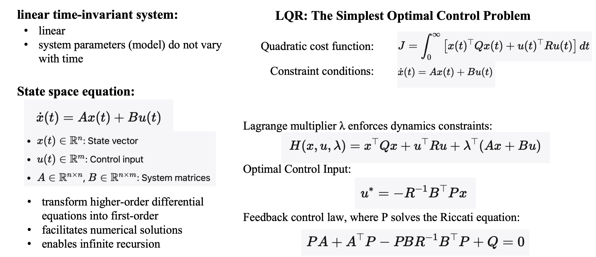
	<figcaption>LQR formulas</figcaption>
</figure>

The figure below shows the inverted pendulum equations. The upper-left part is the linear differential equation of the inverted pendulum, and the lower-left part is its state-space equation. The upper-right part is the feedback-control diagram. What LQR solves for is the feedback matrix $K$. The final control law is $u=-Kx$. Through feedback control, the inverted pendulum can eventually stop at $x=(0,0,0,0)$, that is, the pendulum remains motionless at the origin with zero angle.
<figure class="ros-figure">
	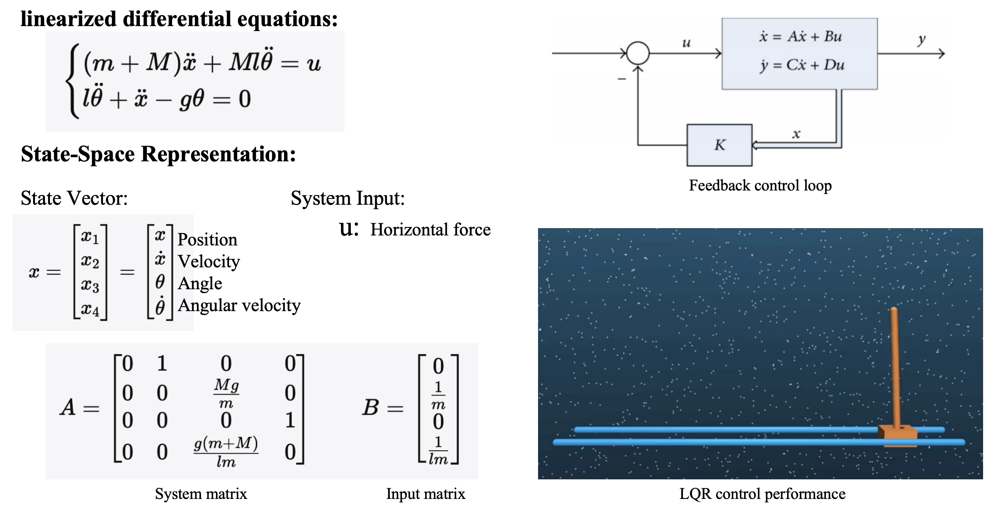
	<figcaption>Linear inverted pendulum</figcaption>
</figure>

### MPC and WBC
The inverted pendulum above is a simple example, so it is easy to model. However, the linear inverted pendulum is still a simplified model, and once the model is simplified, infinite-horizon optimization becomes possible. A real robot model is much more complicated, and in practice we usually cannot solve for the infinite-horizon optimum. We can only solve for a finite-horizon optimum. The figure below shows discrete-time linear MPC. The cost function is also quadratic, except that MPC usually solves for the input sequence that ultimately drives the state to a desired reference value. The constraints are the state-space equation together with other equality or inequality constraints. Linear MPC is solved with a QP solver.

<figure class="ros-figure">
	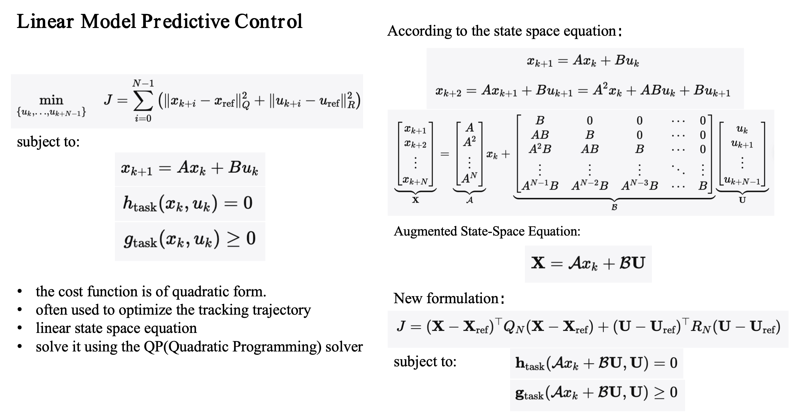
	<figcaption>Linear MPC formulas</figcaption>
</figure>

For nonlinear models, there is also nonlinear MPC, which is solved using SQP.
<figure class="ros-figure ros-figure--narrow">
	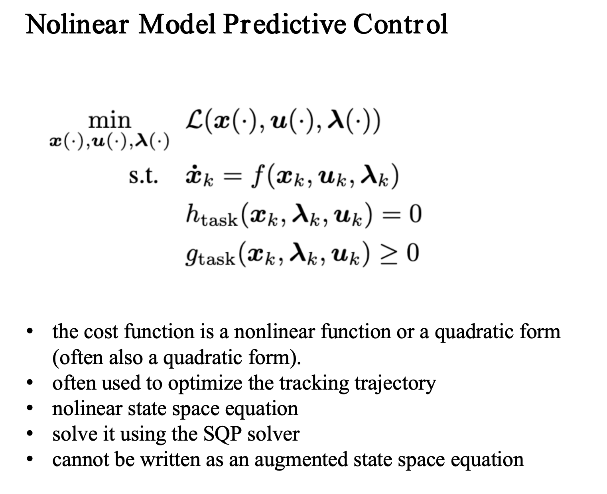
	<figcaption>Nonlinear MPC formulas</figcaption>
</figure>

WBC can refer to several different things. In robot arms, the null-space projection method used to solve joint torques is also called Whole Body Control. On legged robots, if an optimization problem is used to solve for the control quantities of all joints, whether positions or torques, that can also be called WBC. In many humanoid robot papers today, as long as the policy action is the position of all body joints, it may also be called WBC. However, in the context of MPC+WBC, WBC refers to the second meaning, namely using an optimization problem to solve whole-body joint commands.
<figure class="ros-figure">
	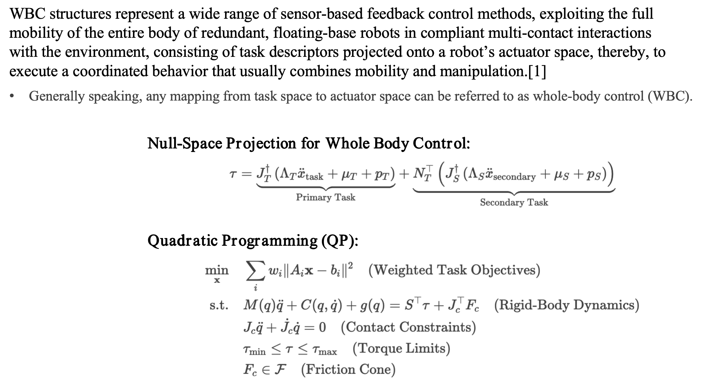
	<figcaption>WBC formulas</figcaption>
</figure>

Next let us look at the Cheetah case. Although it is a quadruped robot rather than a humanoid, this scheme is extremely important. Cheetah uses a two-layer MPC+WBC controller. As with the inverted pendulum example above, the first step is modeling. Because MPC performs rolling optimization over time, we want to reduce its computational cost, so in modeling we use a single rigid body model (SRBD). That is, we treat the quadruped as a rectangular rigid body whose legs have no mass, while the four legs receive upward support forces from the ground. The inputs in the differential equation are the four foot contact forces, and the state variables are the pose and velocity of the rigid body. This gives us a state-space equation, and MPC solves for how much contact force each of the robot's four feet should exert under a given desired velocity.
<figure class="ros-figure">
	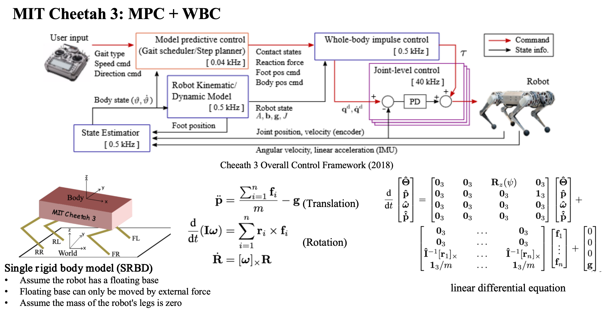
	<figcaption>Cheetah3 control scheme</figcaption>
</figure>

Solving for the foot forces is still not enough, because the actual robot control inputs should be joint commands. In the next step, the WBC optimization problem uses the planned foot forces together with the full-body dynamics model, which is no longer a simplified model but the exact multi-body dynamics equations, to solve for the required joint accelerations. From that, it computes the desired joint positions and sends them to the joint PD controllers.
<figure class="ros-figure">
	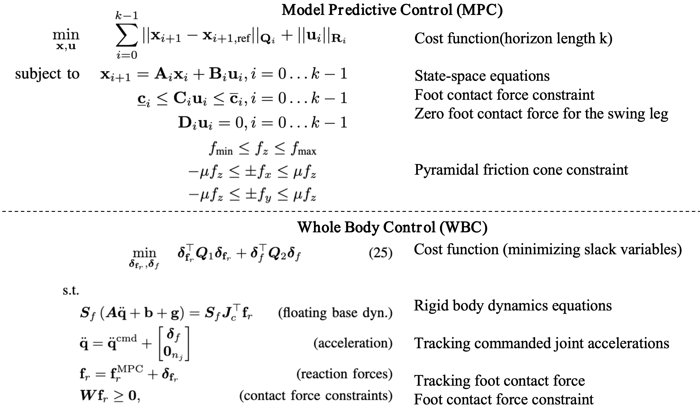
	<figcaption>MPC+WBC formulas</figcaption>
</figure>

Cheetah uses the hierarchical MPC+WBC framework to achieve walking, running, and similar capabilities. At this point, a natural question arises: why does MPC use a simplified model while WBC uses the full model? The reason is that MPC performs rolling optimization, and available compute does not support solving such a complex nonlinear problem, whereas WBC only optimizes a single frame and runs at a higher frequency than MPC. Then the next question is whether a full-dynamics MPC would achieve better control performance if enough computational power were available. The answer is yes. The biggest issue in optimization-based control has always been how to balance computational complexity against modeling accuracy in order to obtain the best control performance.
<figure class="ros-figure">
	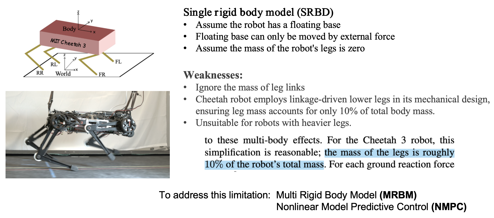
	<figcaption>Limitations of Cheetah</figcaption>
</figure>

### Whole-Body-Dynamics MPC+WBC
Next we introduce a control case for the Fourier GR-1 humanoid robot that uses a whole-body dynamics model. This was the undergraduate thesis project of Ma Liqian, and it also drew on ETH's OCS2 as well as Qiayuan Liao's legged_control. The robot's whole-body dynamics model is the multi-body dynamics equation, which is the most accurate model of the robot. Even though a whole-body dynamics model is used, the MPC optimization still needs to be simplified for the same reason as above. We only take the first six rows, namely the body's accelerations, but compared with the single rigid body model this also accounts for the influence of the leg joints.

<figure class="ros-figure">
	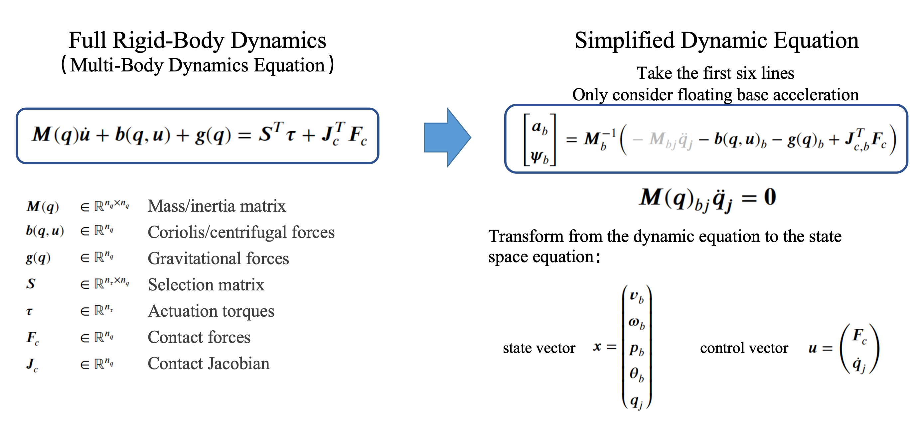
	<figcaption>Multi-body dynamics equations</figcaption>
</figure>

Unlike Cheetah, this scheme does not use MPC to plan foot contact forces. Instead, it plans a body reference trajectory. A reference trajectory is first obtained through footstep gait planning and inverse kinematics, and then MPC adds dynamics constraints to produce a dynamically feasible reference trajectory. Here, MPC acts as a trajectory optimizer.
<figure class="ros-figure">
	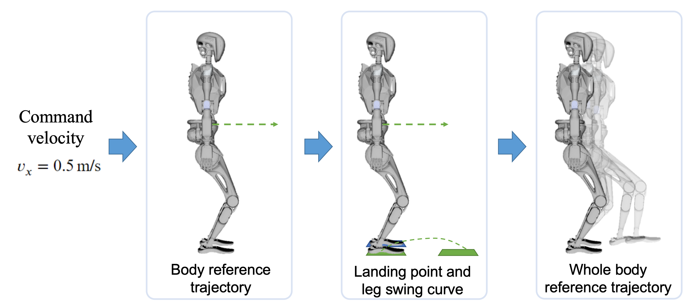
	<figcaption>Leg trajectory planning</figcaption>
</figure>

The control order is the same as in Cheetah: MPC serves as the planner, and WBC outputs joint torques. WBC uses the full whole-body dynamics model as its constraint.
<figure class="ros-figure">
	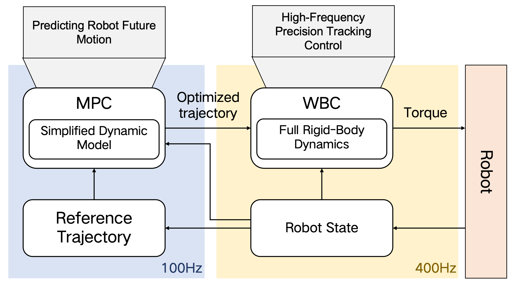
	<figcaption>Control pipeline</figcaption>
</figure>

What follows are the formulas for solving nonlinear MPC and linear WBC.
<figure class="ros-figure">
	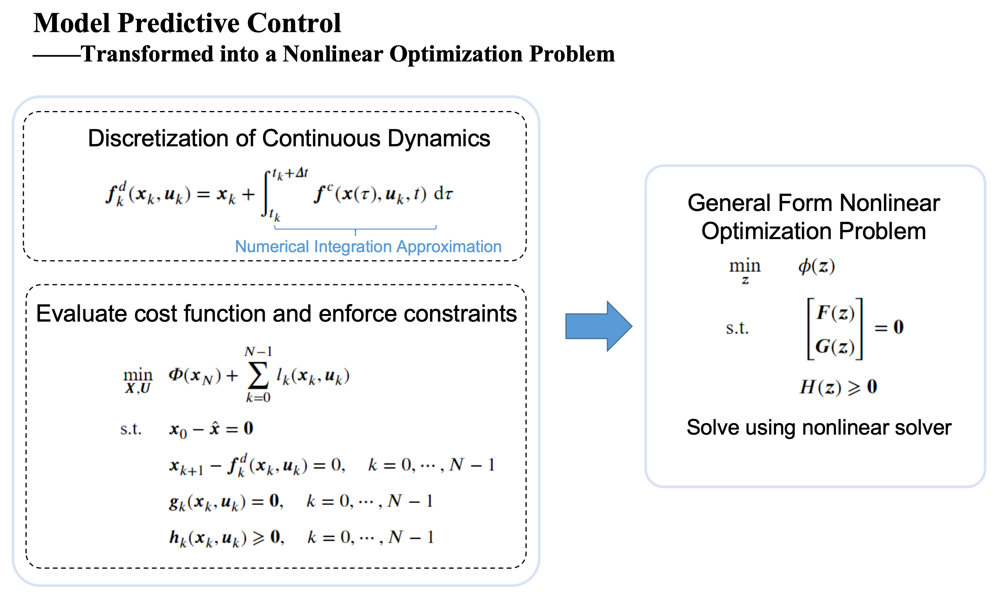
	<figcaption>Nonlinear MPC</figcaption>
</figure>
<figure class="ros-figure">
	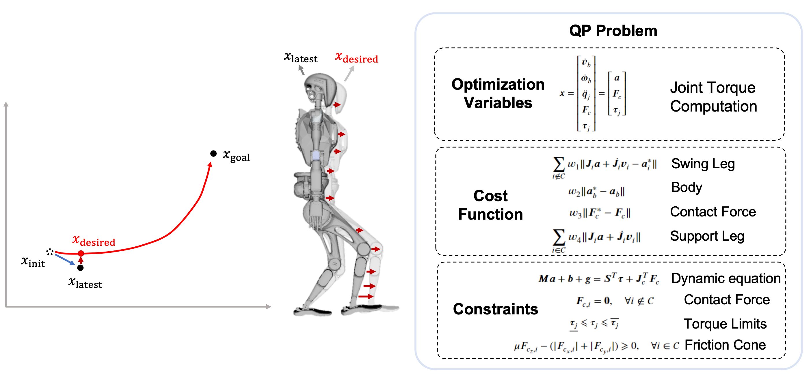
	<figcaption>Solving WBC</figcaption>
</figure>

### Boston Dynamics Atlas
As we can see, the overall framework of optimization-based control is similar for both humanoids and quadrupeds, and the actual solving process is also roughly similar. The key question is how to model the robot and what control quantity is being optimized. Is there a scheme that uses the whole-body dynamics model all the way through from beginning to end? Yes, but it still cannot avoid the problem of insufficient compute. Boston Dynamics took a very aggressive approach: compute MPC offline, then use online MPC+WBC to track the optimized trajectories.

Atlas has a motion library, and during operation it executes motion templates. The advantage is excellent control performance, while the disadvantage is that it can only execute predefined motions.

<figure class="ros-figure">
	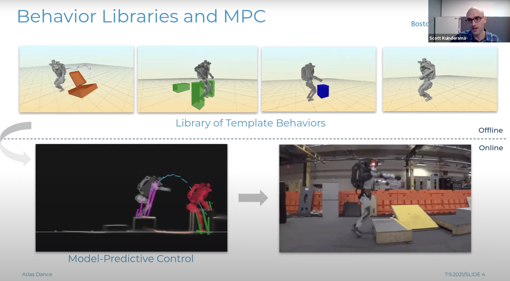
	<figcaption>Atlas offline optimization library and online execution</figcaption>
</figure>
<figure class="ros-figure">
	
	<figcaption>Atlas backflip</figcaption>
</figure>

Atlas's actual scheme is broadly similar to the public papers. Their ability to perform complex motions and difficult maneuvers like backflips depends even more on their strong engineering capability. Atlas V1 uses a single rigid body model, similar to Cheetah. V2 uses a whole-body dynamics model, similar to the humanoid robot control scheme discussed above. V3 adds modeling of tools, but in essence it is still an optimization-based control scheme.

You can watch a talk on the Atlas control scheme on YouTube: [Boston Dynamics control scheme talk](https://www.youtube.com/watch?v=LzmQTf4ODKI&t=348s).

<figure class="ros-figure">
	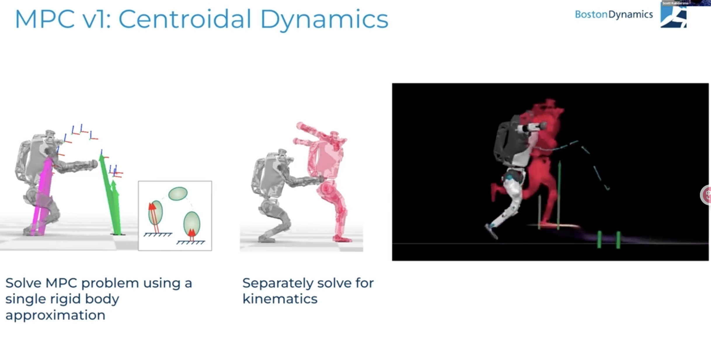
	<figcaption>Atlas V1 control scheme</figcaption>
</figure>
<figure class="ros-figure">
	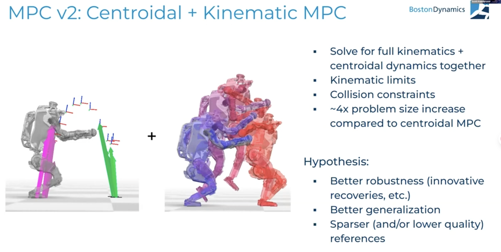
	<figcaption>Atlas V2 control scheme</figcaption>
</figure>
<figure class="ros-figure">
	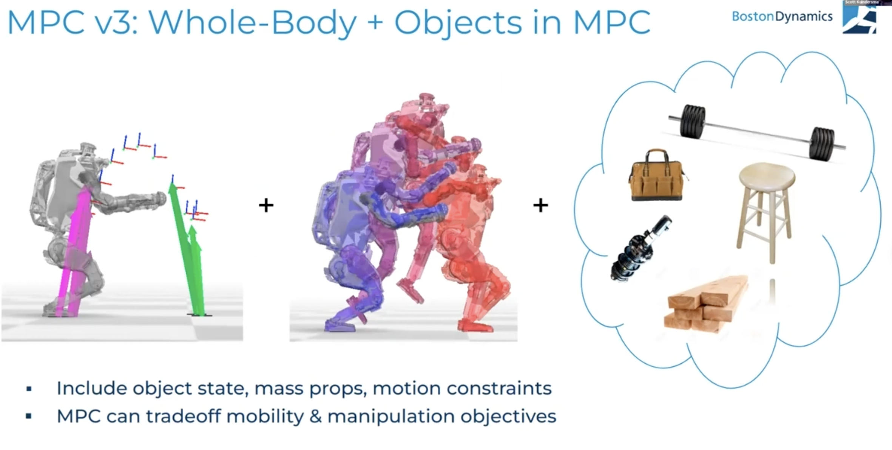
	<figcaption>Atlas V3 control scheme</figcaption>
</figure>

After looking through the schemes above, you should now have some understanding of optimization-based robot control. In practice, the real difficulty lies in how to model the robot. The figure below shows three approaches: 1. plan the contact forces, compute MPC using a simplified model, and compute driving torques using WBC; 2. use the full dynamics model to plan trajectories and use WBC to compute torques; 3. compute contacts and then run full-dynamics MPC. In fact, there can be many more combinations. It all depends on how to balance model accuracy, computational cost, and task requirements.

<figure class="ros-figure">
	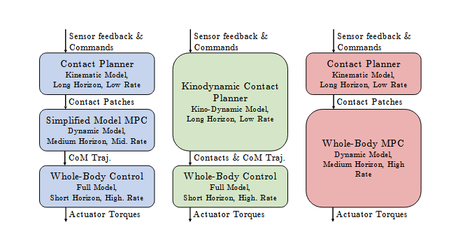
	<figcaption>Three optimization-based control schemes</figcaption>
</figure>

## Reinforcement Learning
Optimization-based control always requires a simplified model. Is there some way to use the most complete dynamics model while still achieving good control performance under limited computational resources? Yes. That is the now-popular reinforcement learning controller. In robotics, reinforcement learning means allowing the robot to learn a control policy autonomously through continuous interaction with the environment under the feedback mechanism of state, action, and reward. After executing an action, the robot receives a reward or penalty based on the result, and gradually adjusts its decisions so as to maximize cumulative return.

<figure class="ros-figure">
	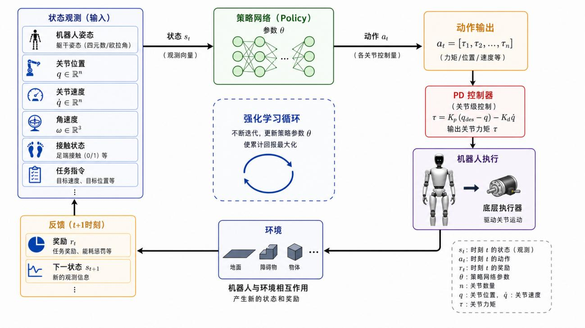
	<figcaption>Reinforcement learning</figcaption>
</figure>

The computational cost of optimization-based control depends on the model complexity and prediction horizon of MPC, while the computational cost of a reinforcement learning controller depends on the number of policy parameters. In practice, policies are basically all 3-layer MLPs, so the computational cost is not really the issue. The model used in optimization-based control depends on how we choose to model the robot. In contrast, during the learning process of a reinforcement learning controller, the model is always the simulator model, namely the complete multi-body dynamics model. Friction and collisions can also be simulated according to a detailed mechanical design model. Note that the multi-body dynamics model in optimization-based control is:

$$M(q)\dot{u} + b(q, u) + g(q) = S^{T}\tau + J_{c}^{T}F_{c}$$

On the right-hand side, $F_c$ is the external force. That means an optimization-based controller must know the magnitude, direction, and point of application of the external force in order to include it in the model. But that is not feasible on a robot, because the robot does not yet have full-body tactile sensing, and the friction and collisions with the ground can only be approximated. Therefore, a natural advantage of reinforcement learning controllers is that they can use the complete dynamics model while also accounting for external forces and terrain effects. A reinforcement learning controller can infer external force information from the robot's IMU and joint position changes and make corresponding recovery motions. This is something optimization-based controllers cannot do.

Training a reinforcement learning controller is generally done by first training in one simulator, then validating with Sim2Sim in another simulator, and finally transferring to the real robot with Sim2Real.

<figure class="ros-figure ros-figure--narrow">
	
	<figcaption>Sim2Sim and Sim2Real</figcaption>
</figure>

Because reinforcement learning has relatively few formulas beyond the basic ones, and because most people's schemes are similar and there are already many tutorial documents online, we will not go into further detail here. Later on, we will discuss the AMP and Mimic schemes.

## References
[1] Gu, Z., Li, J., Shen, W., Yu, W., Xie, Z., McCrory, S., ... & Zhao, Y. (2025). Humanoid locomotion and manipulation: Current progress and challenges in control, planning, and learning. arXiv preprint arXiv:2501.02116.

[2] Moro, F. L., & Sentis, L. (2019). Whole-body control of humanoid robots. Humanoid robotics: a reference, 1161-1183.

[3] Kim, D., Di Carlo, J., Katz, B., Bledt, G., & Kim, S. (2019). Highly dynamic quadruped locomotion via whole-body impulse control and model predictive control. arXiv preprint arXiv:1909.06586.

[4] Di Carlo, J., Wensing, P. M., Katz, B., Bledt, G., & Kim, S. (2018, October). Dynamic locomotion in the mit cheetah 3 through convex model-predictive control. In 2018 IEEE/RSJ international conference on intelligent robots and systems (IROS) (pp. 1-9). IEEE.

[5] Grandia, R., Jenelten, F., Yang, S., Farshidian, F., & Hutter, M. (2023). Perceptive locomotion through nonlinear model-predictive control. IEEE Transactions on Robotics, 39(5), 3402-3421

[6] Wensing, P. M., Posa, M., Hu, Y., Escande, A., Mansard, N., & Del Prete, A. (2023). Optimization-based control for dynamic legged robots. IEEE Transactions on Robotics, 40, 43-63.

[7] Rudin, N., Hoeller, D., Reist, P., & Hutter, M. (2022, January). Learning to walk in minutes using massively parallel deep reinforcement learning. In Conference on Robot Learning (pp. 91-100). PMLR.

[8] https://github.com/roboterax/humanoid-gym
