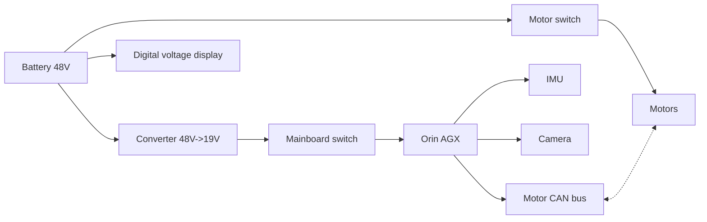

# Circuit Design and PCB Production

## Circuit Design

The previous section summarized the electrical design requirements. Our circuit requirements can be represented by the following block diagram:

In the first version of the design, we directly used NMOS transistors as switches, and an off-the-shelf voltage converter module for power conversion. The module supports 30-60 V input and provides 19 V, 5 A output. This circuit could perform its function stably when the current was relatively small, but because the peak current of 20 motors is quite high and there can also be surge current, the MOS switch was repeatedly burned out.

<figure class="ros-figure ros-figure--narrow">
	
	<figcaption>Circuit schematic V1</figcaption>
</figure>

	<figure class="ros-figure ros-figure--paired">
		
		<figcaption>PCB layout V1</figcaption>
	</figure>
	<figure class="ros-figure ros-figure--paired">
		
		<figcaption>PCB hardware V1</figcaption>
	</figure>

In the second version, we added a relay and the circuit became somewhat more stable, but the relay could still break down when the battery was connected. We will need to think of a better solution in the next version.

<figure class="ros-figure ros-figure--narrow">
	
	<figcaption>Circuit schematic V2</figcaption>
</figure>

	<figure class="ros-figure ros-figure--paired">
		
		<figcaption>PCB layout V2</figcaption>
	</figure>
	<figure class="ros-figure ros-figure--paired ros-gallery--pair-full">
		
		<figcaption>PCB hardware V2</figcaption>
	</figure>

Because the motors require four CAN buses, we purchased a CAN breakout board. It takes XT60 current input, and its other four CAN plus power interfaces connect to the four motor branches. The CAN signal wires on this board happen to be reversed relative to the motor signal wires, so on the first motor connection the signal wires need to be swapped. The four CAN signals are then converted to USB and connected to the mainboard.

The converter, relay, battery, and CAN breakout board are shown below.

	<figure class="ros-figure">
		
		<figcaption>Converter</figcaption>
	</figure>
	<figure class="ros-figure">
		
		<figcaption>Relay</figcaption>
	</figure>
	<figure class="ros-figure">
		
		<figcaption>Battery</figcaption>
	</figure>
	<figure class="ros-figure">
		
		<figcaption>CAN breakout board</figcaption>
	</figure>

