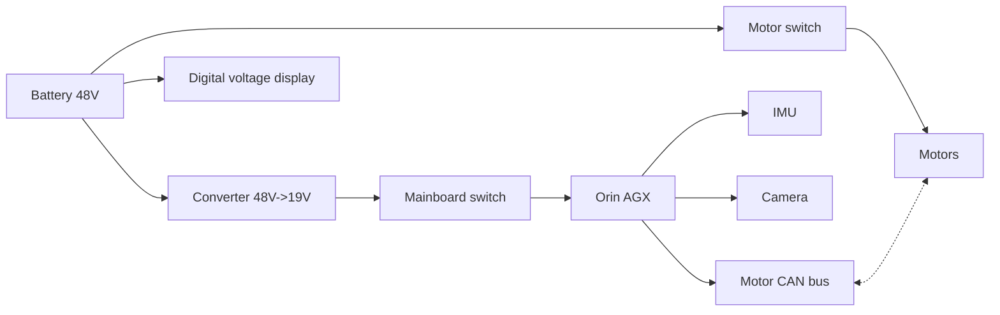
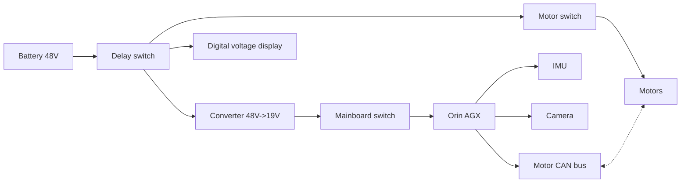
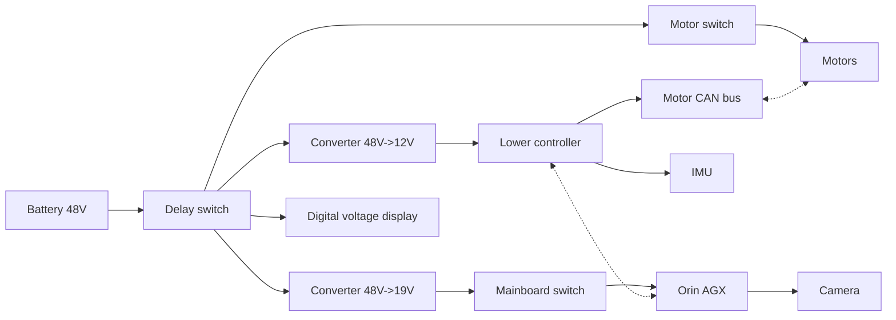

# Electrical System Overview

This section introduces the module breakdown, key components, and safety boundaries of the robot's electrical system.

## Overall Design

The circuit system is probably the weakest part of our design, because it relies heavily on engineering experience, and this is not something that is systematically taught in our department. We learned PCB design on our own, so this chapter should be used for reference only.

Different devices in the robot require power, including motors with voltages of 24 V, 36 V, or 48 V and per-motor current of 0 to 2 A; the mainboard, with voltages of 12 V or 19 V and current of 0 to 5 A; and sensors such as the IMU and camera, which use 3.3 V or 5 V. There may also be speakers, light strips, and other devices, but those can usually be powered directly from the mainboard. Since different devices require different voltages and currents, the robot's power circuit must provide multiple voltage rails. Because the IMU, camera, and other devices using 5 V or less can all be powered through the mainboard, via USB or pin headers, the most important task for the power circuit is supplying power to the motors and the mainboard.

We chose ENCOS motors, all of which use 48 V power, and we selected the NVIDIA Jetson Orin AGX as the mainboard, which requires 19 V input. Therefore, our circuit framework is as follows, where dashed lines represent signal connections.

The core problem in this circuit is how to implement the converter and the switches. Since the motor current can become quite large, the total current of 20 motors may reach 10 to 30 A. Using a mechanical switch can cause arcing, which may damage both the switch and the devices. We tried two electronic switching solutions and finally chose a relay as the switch. The relay control side uses the stepped-down 19 V supply. The voltage converter was purchased as an off-the-shelf module. Our solution is still somewhat rough, and if you have the capability, it is better to design the modules yourself, but the overall architecture is sound.

There is one more minor issue with the framework above. The robot battery is removed frequently, and if the circuit is always connected directly, there can still be sparking when the battery is plugged in. So it is better to add a control circuit at the input end together with a trigger, allowing the circuit to be enabled only after holding a button for more than three seconds.

There is also another possible requirement. If your robot uses a host and lower-controller architecture, which is introduced in the communication overview section, then you need to add another voltage-conversion branch according to the lower controller's voltage requirement, because the host generally cannot power the lower controller directly. The host and lower controller can be connected through CAN, Ethernet, or similar interfaces.

