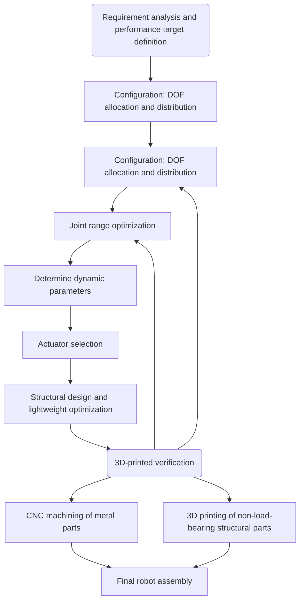

# Mechanical Design Overview

This section introduces the design ideas and implementation approach of the robot's mechanical body.

## Design Approach

The normal workflow includes configuration design, degree-of-freedom allocation and distribution, configuration space considerations, structural design, industrial design, and mechanical fabrication. Our mechanical design is not perfect. In practice, we were missing part of the industrial design stage, such as cable routing, outer shell design, and similar details, because our student team did not have enough experience or time to complete those refined tasks. Still, the overall design path follows a standard process, as shown in the flowchart below.

For a student team like ours, one full cycle usually takes four to five months. After excluding holidays, classes, exams, and competition preparation, we can basically update the robot once per year. Even so, that pace is already fairly good.

The following pages introduce the overall mechanical design according to the flowchart above.
