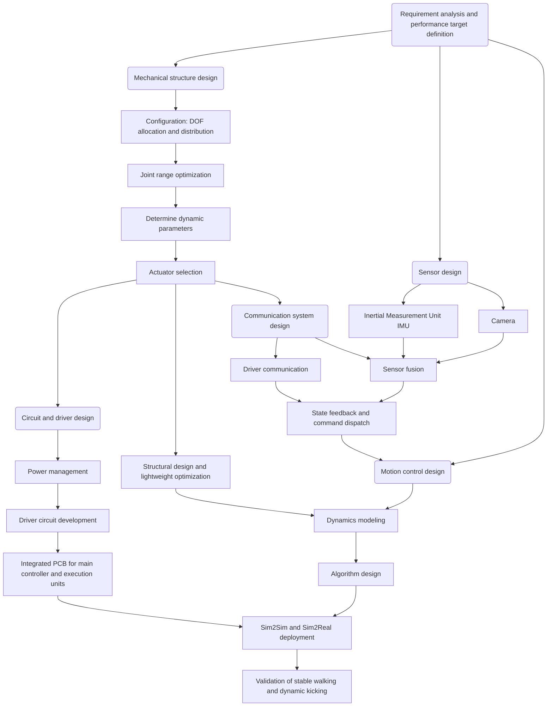

# System Architecture

This page describes the overall organization of the robot system from hardware to software.

## System Composition

In general, robot design can be divided into four main parts:

1. Mechanical design: configuration design, degree-of-freedom allocation and distribution, configuration space, structural design, industrial design, and so on. Mechanical design determines what functions the robot can achieve when interacting with the physical world.

2. Electrical system design: power supply circuits and communication circuits. The power system includes the battery, switches, voltage conversion, and related components. Communication circuits are used by drivers, sensors, and other devices. Electrical design ensures that actuators and sensors operate correctly.

3. Communication system design: this can be divided into external communication and internal communication. A robot generally has a host computer that connects to sensors, drivers, or lower-level controllers, which is considered external communication. Physical communication methods include wired communication such as CAN and USB, and wireless communication such as Wi-Fi and Bluetooth. Internal communication refers to communication between processes inside the host, using frameworks such as DDS, ROS, and ZMQ.

4. Motion control design: the robot's motion control method, which ultimately enables the robot to move and interact with the physical world.

## Architecture Diagram

The diagram above shows the overall design workflow of the robot system from requirement analysis to functional validation, as well as the dependencies among the different modules.

The system starts by defining overall performance requirements based on the target tasks, such as stable walking, posture perception, and dynamic kicking. On this basis, the team carries out mechanical design, including degree-of-freedom allocation, structural design, dynamic parameter determination, and actuator selection, which together provide the foundation for the robot's motion capability.

Sensor design proceeds in parallel with mechanical design. Sensors such as the IMU and camera are used to obtain the robot's internal state and information about the external environment. Through the communication system, they are connected to the main controller and provide input for state estimation, perception fusion, and motion control.

At the hardware level, the electrical system is responsible for power management, driver circuit development, and integration of the main controller with the execution units, ensuring that actuators and sensors work reliably. The communication system connects drivers, sensors, and the main controller, enabling state feedback, command dispatch, and multi-source data fusion.

After the hardware and communication foundations are completed, the system enters the motion-control design stage, including dynamics modeling, control algorithm design, and Sim2Sim and Sim2Real deployment. Finally, the overall design is validated through tasks such as stable walking and dynamic kicking. In practice, motion control depends strongly on actuator selection, so the controller type must be determined before choosing the motors. Reinforcement-learning controllers, for example, require the motor control loop to satisfy certain performance conditions. In this sense, robot design is fundamentally tightly coupled from end to end.

Overall, this architecture reflects a layered and progressively integrated development style: requirements are clarified first, then the mechanical and hardware foundations are completed, followed by communication and perception pipelines, and finally control algorithms and full-system validation.

The following sections introduce the core parts of the robot system in more detail, including:

- Mechanical design
- Electrical system design
- Communication system design
- Motion control design

Each chapter explains the design ideas and implementation methods through specific modules.
