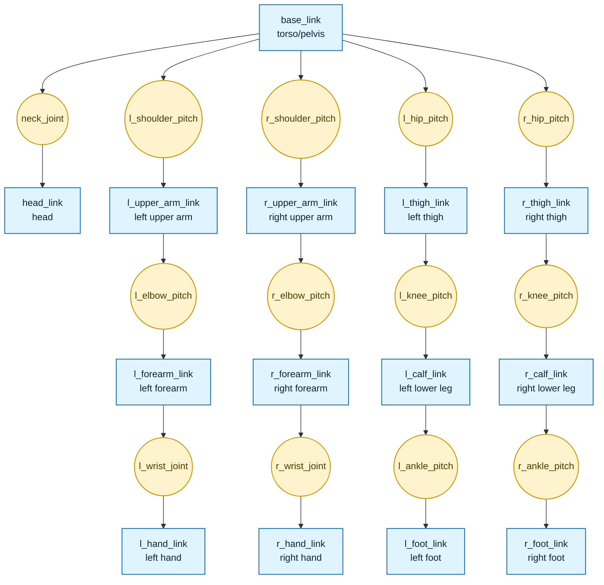

# Simulation, Models, and Data

This section introduces simulators, robot simulation models, and robot motion data.

## Robot Simulation Models
Most humanoid and quadruped robots today use reinforcement learning to train controllers. Training is performed in a simulator, and controller capability is also validated in simulation. Common simulators include IsaacSim and Mujoco, while common training frameworks include IsaacLab and Mjlab.

<div class="ros-gallery ros-gallery--pair ros-gallery--pair-full">
	<figure class="ros-figure ros-figure--paired">
		
		<figcaption>IsaacLab</figcaption>
	</figure>
	<figure class="ros-figure ros-figure--paired ros-gallery--pair-full">
		
		<figcaption>Mujoco</figcaption>
	</figure>
</div>

Different simulators use different model files to describe the robot. The most common one is URDF (Unified Robot Description Format), which is applicable to virtually any simulator. XML files are specific to Mujoco, while USD is specific to IsaacSim and IsaacLab. In practice, people usually start with a URDF and then convert it into the other two formats.

URDF is used to define the robot's rigid-body structure, joint connectivity, geometric shape, mass and inertia, collision model, visual model, and some transmission or plugin extension information. If you imagine describing a humanoid robot as an abstract tree diagram, it would look like the figure below. URDF is simply a code-based representation of that tree. A Link represents a rigid part of the robot, such as the torso, head, upper arm, lower leg, or foot. A Joint represents the connection and motion constraint between rigid bodies, such as the shoulder, elbow, hip, or knee.



A link usually contains three categories of information:

- visual: visual appearance
- collision: collision computation
- inertial: inertial parameters

The visual section defines what this part looks like. It usually includes:

- geometry
- origin, the relative pose
- material

The collision section defines the geometry used for collision detection. It is usually separated from visual because the visual model can be very detailed, while the collision model is typically kept simpler to improve computational efficiency.

The inertial section defines the inertia information required for physical simulation, including:

- mass
- origin, the center-of-mass position
- inertia matrix

For example:
```
<link name="upper_arm">
	<visual>
		<origin xyz="0 0 0.2" rpy="0 0 0"/>
		<geometry>
			<cylinder radius="0.04" length="0.4"/>
		</geometry>
		<material name="blue"/>
	</visual>
	<collision>
		<origin xyz="0 0 0.2" rpy="0 0 0"/>
		<geometry>
			<cylinder radius="0.05" length="0.4"/>
		</geometry>
	</collision>
	<inertial>
		<origin xyz="0 0 0.2" rpy="0 0 0"/>
		<mass value="2.0"/>
		<inertia
			ixx="0.01" ixy="0.0" ixz="0.0"
			iyy="0.02" iyz="0.0"
			izz="0.01"/>
	</inertial>
</link>

```

A joint is used to connect two links and describe their relative motion relationship. A joint usually defines:

- parent link: parent
- child link: child
- joint type: type
- mounting pose: origin
- motion axis: axis
- limits: limit

For example, the snippet below means that upper_arm is connected to torso through a revolute joint mounted at a position on the torso, rotating about the y-axis with a motion range from -1.57 to 1.57 radians.

```
<joint name="shoulder_pitch" type="revolute">
	<parent link="torso"/>
	<child link="upper_arm"/>
	<origin xyz="0.2 0 0.5" rpy="0 0 0"/>
	<axis xyz="0 1 0"/>
	<limit lower="-1.57" upper="1.57" effort="50" velocity="2.0"/>
</joint>
```

Common joint types in URDF include:

- fixed: a fixed joint with no relative motion, suitable for rigid structural connections
- revolute: a rotational joint with upper and lower angle limits, suitable for robot joints
- continuous: a continuously rotating joint with no angle limits, suitable for wheels
- prismatic: a translational joint that moves along an axis, suitable for linear actuators


There are many open-source URDF examples available, and you can easily pick any of them as a reference. XML and USD are similar kinds of files; they simply use different description methods.

At this point, we only have a mechanical model, not yet a simulation model. The remaining sections of this chapter explain the detailed steps for exporting URDF, XML, and USD from the mechanical model.

## Robot Motion Data
Humanoid robots increasingly use reference data for training, and most of this reference data comes from human motion-capture data, such as BVH (Biovision Hierarchy) files. BVH files can be viewed with a viewer: [BVH viewer](https://theorangeduck.com/media/uploads/BVHView/bvhview.html). There are also other description formats, such as SMPLX model data. Some people also store the data directly in CSV. The underlying principle is the same: all of these formats define how the robot moves, storing joint angles for each frame, the root pose, timestamps, body velocities and accelerations, and so on.

<figure class="ros-figure">
	
	<figcaption>BVH motion data</figcaption>
</figure>

Once motion data is available, because the human body structure and the robot structure are not identical, the data must be retargeted to the humanoid robot's structure. This requires the BVH file and the robot URDF model so that a mapping can be established between joints and links, and an optimization problem can be solved to recover joint angle values and related quantities mapped onto the robot structure. Many people have already explained retargeting, and many use [GMR](https://github.com/YanjieZe/GMR).
