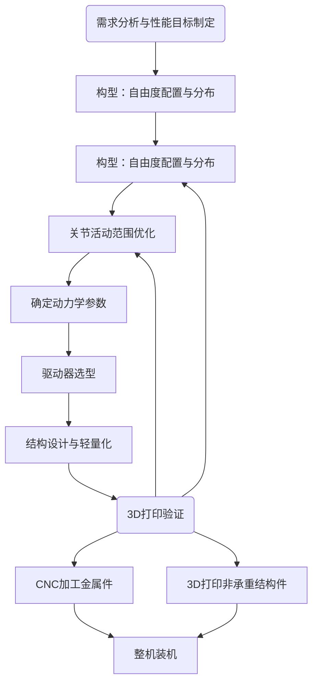

# 机械设计概览

本部分介绍机器人机械本体的设计思路与实现方式。

## 设计思路

正常的流程包括构型设计、自由度配置与分布、位形空间、结构设计、工业设计、机械加工。我们的机械设计并不完美，实际上我们缺少了工业设计的环节，即设计走线、外壳等等，因为我们团队同学没有足够的经验以及时间去做一些精细设计。但大体上思路是符合标准的，参见如下流程图：

对于我们学生团队的话，一整个流程下来需要4-5个月，除去假期以及上课、考试、准备比赛的时间，我们基本上只能每年更新一版，但这个速度已经算不错了。

接下来的内容将根据上面的流程图介绍整体机械设计。