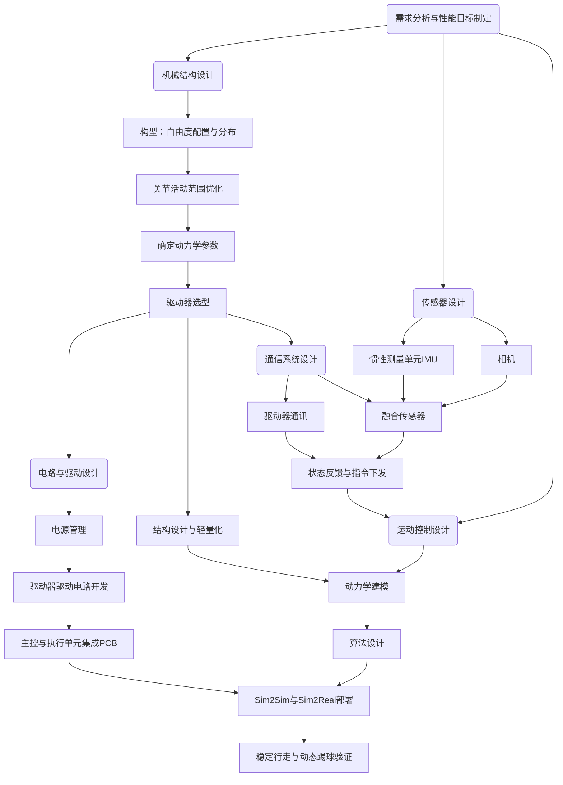

# 系统总体架构

本页描述机器人系统从硬件到软件的总体组织方式。

## 系统组成

一般机器人设计都可以分成四个主要的部分：

1. 机械设计：设计构型、自由度配置与分布、位形空间、结构设计、工业设计等。机械设计决定了机器人与物理世界交互所能实现的功能。

2. 电气系统设计：供电电路与通讯电路，供电电路包括电池、开关、电压转换等，通讯电路是驱动器、传感器等通讯使用的电路。电气设计保证执行器和传感器能正常运行。

3. 通讯系统设计：分为机外通讯和机内通讯两部分。机器人一般会有一个主机，主机和传感器、驱动器或下位机连接，称为机外通讯。物理通讯方式有多种，比如CAN、USB等有线通讯，WiFi、蓝牙等无线通讯。机内通讯指主机内各个进程之间通讯，有DDS、ROS、ZMQ等框架。

4. 运动控制设计：机器人运动控制方式，最终让机器人活动与物理世界交互。

## 架构图

上图展示了机器人系统从需求分析到功能验证的总体设计流程，以及各模块之间的依赖关系。

系统首先根据目标任务确定整体性能需求，例如稳定行走、姿态感知和动态踢球。在此基础上开展机械设计，完成自由度配置、结构设计、动力学参数确定和驱动器选型，为整机运动能力提供基础。

传感器设计与机械设计同步进行。IMU 和相机等传感器用于获取机器人自身状态和外部环境信息，并通过通信系统接入主控，为状态估计、感知融合和运动控制提供输入。

在硬件层面，电气系统负责电源管理、驱动电路开发以及主控和执行单元的集成，保证执行器与传感器能够稳定工作。通信系统则负责连接驱动器、传感器和主控模块，实现状态反馈、指令下发和多源数据融合。

在完成硬件与通信基础之后，系统进入运动控制设计阶段，包括动力学建模、控制算法设计以及 Sim2Sim、Sim2Real 部署。最终通过稳定行走和动态踢球等任务，对机器人整体设计进行验证。但实际上，运动控制非常依赖驱动器选型，所以在电机选型之前就要确定使用的控制器类型，强化学习控制器则需求电机控制环满足一定要求。所以机器人设计本质上环环相扣。

整体上，该架构体现了一种分层设计、逐步集成的开发方式：先明确需求，再完成机械与硬件基础，随后建立通信与感知链路，最后实现控制算法并进行整机验证。

下面将分别介绍机器人系统的几个核心部分，包括：

- 机械设计
- 电气系统设计
- 通信系统设计
- 运动控制设计

各章节将结合具体模块，说明系统的设计思路与实现方式。