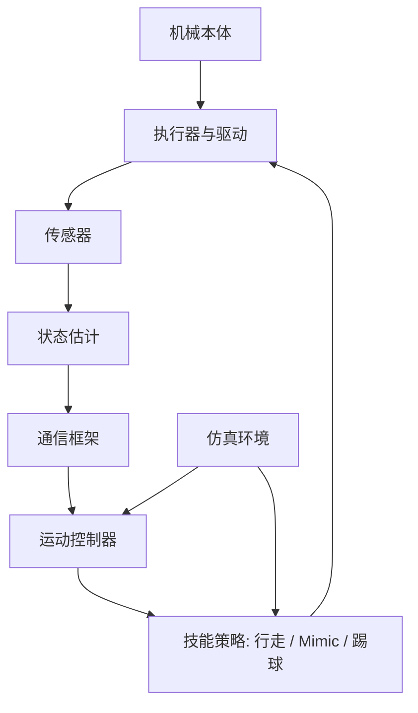

# 系统总体架构

本页描述机器人系统从硬件到软件的总体组织方式。

## 系统组成

整个系统可以拆分为以下几层：

1. 机械本体
2. 电气与执行层
3. 传感与状态估计
4. 通信中间件
5. 运动控制与技能层
6. 仿真与训练环境
7. 开发与部署工具链

## 架构图

## 各层职责

## 机械本体
负责关节布局、自由度设计、结构强度、传动形式与可维护性。

## 电气与执行层
负责供电、驱动、控制板连接、执行器接口和安全保护。

## 通信框架
负责不同模块间的数据交换，定义消息格式、传输频率和同步方式。

## 运动控制层
负责将高层目标转化为执行器命令，包括：

- 轨迹生成
- 逆运动学
- 平衡控制
- 步态控制
- 技能状态机

## 仿真与训练层
负责模型导入、环境搭建、策略训练、评估以及 sim-to-real 迁移。

## 推荐阅读

- [硬件与软件映射](hardware-software-map.md)
- [通信框架概览](../communication/index.md)
- [运动控制概览](../control/index.md)
- [仿真与模型概览](../simulation/index.md)