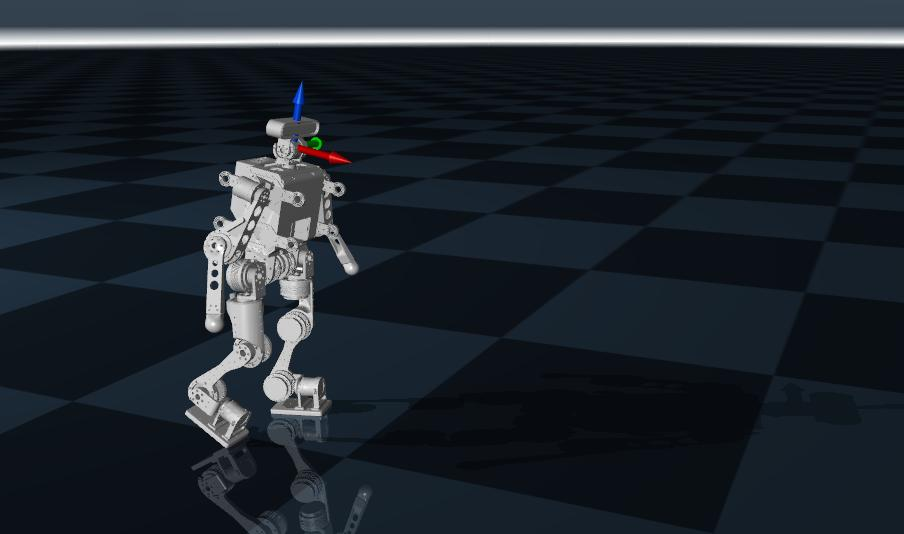
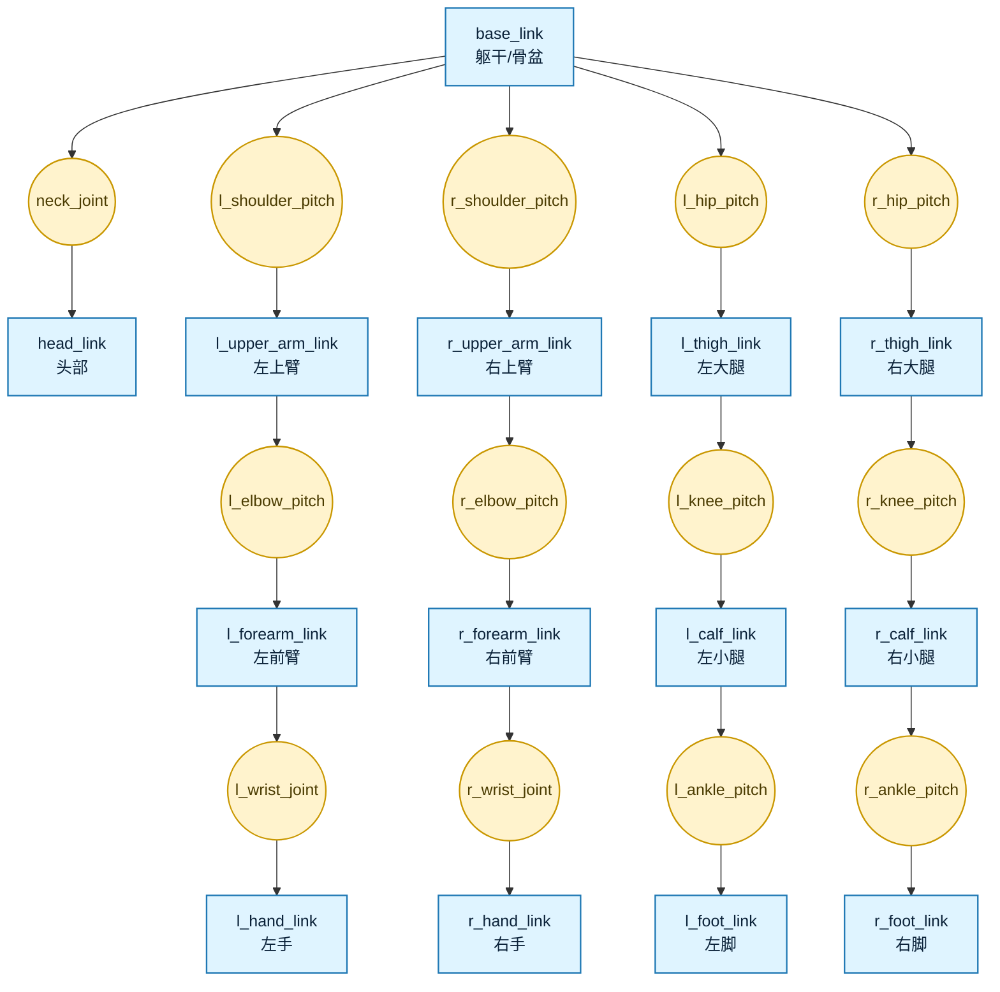

# 仿真、模型与数据

本部分介绍仿真器、机器人仿真模型以及机器人动作数据。

## 机器人仿真模型
现在的人形机器人或四足机器人大多都使用强化学习训练控制器，训练过程在仿真器中，并且验证控制器能力也是在仿真器中。常用的仿真器有IsaacSim、Mujoco，训练框架有IsaacLab、Mjlab等。

<div class="ros-gallery ros-gallery--pair ros-gallery--pair-full">
    <figure class="ros-figure ros-figure--paired">
        
        <figcaption>IsaacLab</figcaption>
    </figure>
    <figure class="ros-figure ros-figure--paired ros-gallery--pair-full">
        
        <figcaption>Mujoco</figcaption>
    </figure>
</div>

在不同的仿真器里用不同的模型文件来描述机器人，常用的是URDF（Unified Robot Description Format），在任何仿真器都适用。XML文件专用于Mujoco，USD专用与IsaacSim和IsaacLab。通常先有URDF，然后转换成另外两个。

URDF用来定义机器人的刚体结构、关节连接关系、几何外形、质量和惯量、碰撞模型、可视化模型、部分传动/插件扩展信息。想象一下一个人形机器人如果用抽象的树状图来描述的话，就像下面这张图一样，URDF就是将这个树状图用代码来表示。Link 表示机器人中的刚体部件，如躯干、头部、上臂、小腿和脚；Joint 表示刚体之间的连接和运动约束，如肩关节、肘关节、髋关节和膝关节。



一个 link 里通常包含三类信息：

- visual：外观显示
- collision：碰撞计算
- inertial：惯性参数

visual用于定义这个部件“看起来是什么样”。里面通常包括：

- 几何形状 geometry
- 相对位姿 origin
- 材质 material

collision用于定义碰撞检测时使用的几何体。它通常和 visual 分开，因为可视化模型可以很精细；碰撞模型通常希望更简单，便于提高计算效率

inertial用于定义物理仿真所需的惯性信息，包括：

- 质量 mass
- 质心位置 origin
- 惯性矩阵 inertia

例如：
```
<link name="upper_arm">
    <visual>
        <origin xyz="0 0 0.2" rpy="0 0 0"/>
        <geometry>
            <cylinder radius="0.04" length="0.4"/>
        </geometry>
        <material name="blue"/>
    </visual>
    <collision>
        <origin xyz="0 0 0.2" rpy="0 0 0"/>
        <geometry>
            <cylinder radius="0.05" length="0.4"/>
        </geometry>
    </collision>
    <inertial>
        <origin xyz="0 0 0.2" rpy="0 0 0"/>
        <mass value="2.0"/>
        <inertia
            ixx="0.01" ixy="0.0" ixz="0.0"
            iyy="0.02" iyz="0.0"
            izz="0.01"/>
    </inertial>
</link>

```

joint 用于连接两个 link，描述它们之间的相对运动关系。一个 joint 通常要定义：

- 父 link：parent
- 子 link：child
- 关节类型：type
- 安装位姿：origin
- 运动轴：axis
- 限位：limit

例如这里表示upper_arm 通过一个旋转关节连接到 torso关节安装在躯干某个位置绕 y 轴旋转转动范围是 −1.57 到 1.57 弧度

```
<joint name="shoulder_pitch" type="revolute">
    <parent link="torso"/>
    <child link="upper_arm"/>
    <origin xyz="0.2 0 0.5" rpy="0 0 0"/>
    <axis xyz="0 1 0"/>
    <limit lower="-1.57" upper="1.57" effort="50" velocity="2.0"/>
</joint>
```

URDF 中常见关节类型包括：

- fixed固定关节，没有相对运动，适合连接固定结构件
- revolute旋转关节，有角度上下限，适合机器人关节
- continuous连续旋转关节，没有角度上下限，适合轮子
- prismatic平移关节，沿某一轴线平移，适合直线驱动器


URDF有很多开源的，可以随便找一个去参考。XML和USD是类似的文件，只不过描述方式不一样。

我们到目前为止只有机械模型，还没有仿真模型。本章后续内容会讲解从机械模型导出URDF、XML、USD的详细步骤。

## 机器人动作数据
现在人形机器人越来越多地使用参考数据进行训练，这些参考数据大多都来自于人体动捕数据，比如BVH（Biovision Hierarchy）人体数据。BVH文件可以通过viewer查看：[BVH viewer](https://theorangeduck.com/media/uploads/BVHView/bvhview.html)。还有其他描述方式，比如SMPLX模型格式数据。也由于人用csv直接存储，但是原理都是一样的，他们都是定义了机器人怎么动，存储的内容是每一帧关节角度、根节点位姿、时间戳、身体速度/加速度等。

<figure class="ros-figure">
    
    <figcaption>BVH动作数据</figcaption>
</figure>

有了动作数据，因为人体结构和机器人结构并不相同，需要重定向（Retarget）到人形机器人的结构上，这个时候就需要用BVH文件和机器人URDF模型，建立一个关节、连杆映射关系，通过解优化问题来解算出来映射到机器人结构上的关节角度值等。重定向有很多人讲过，很多人都使用[GMR](https://github.com/YanjieZe/GMR)。